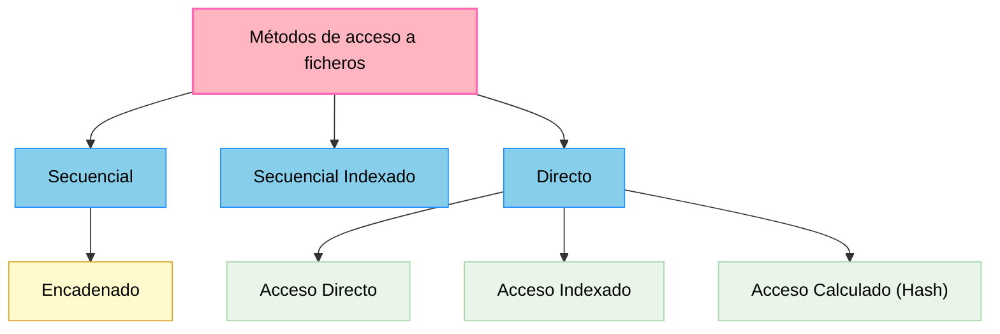

## UD1.- Almacenamiento de la información

### 1.- Introducción

Casi todo lo que nos rodea, en alguna medida, está relacionado con los datos, su almacenamiento y su gestión. El gran volumen de datos que actualmente manejamos y sus innumerables posibilidades requieren de la existencia de técnicos perfectamente formados y capaces de trabajar con ellos.

En esta primera unidad comenzaremos conociendo los primeros sistemas basados en ficheros para el almacenamiento y gestión de la información. Seguidamente, se desarrollarán los conceptos y definiciones básicas relacionadas con las bases de datos, posteriormente analizaremos sus modelos y tipos, un poco más adelante, podremos conocer las características y capacidades de los sistemas gestores de bases de datos y finalmente, identificaremos las herramientas reales con las que llevar a cabo la gestión de dichas bases.

### 2.- Los ficheros de información

#### 2.1.- ¿Qué es un fichero?

Un **fichero o archivo** es conjunto de información relacionada, tratada como un todo y organizada de forma estructurada. Es una secuencia de dígitos binarios que organiza información relacionada con un mismo aspecto.

Los ficheros están formados por registros lógicos que contienen datos relativos a un mismo elemento u objeto (por ejemplo, los datos de usuarios de una plataforma educativa). A su vez, los registros están divididos en campos que contienen cada una de las informaciones elementales que forman un registro (por ejemplo, el nombre del usuario o su dirección de correo electrónico).

Los datos están almacenados de tal forma que se puedan añadir, suprimir, actualizar o consultar individualmente en cualquier momento.

Como los ficheros suelen ser muy voluminosos, solo se pueden llevar a la memoria principal partes de ellos para poder procesarlos. La cantidad de información que es transferida entre el soporte en el que se almacena el fichero, y la memoria principal del ordenador, en una sola operación de lectura/grabación, recibe el nombre de **registro físico** o **bloque**.

Normalmente en cada operación de lectura/grabación se transfieren varios registros del fichero, es decir, un bloque suele contener varios registros lógicos. Al número de registros que entran en un bloque se le conoce con el nombre de **factor de blocaje** o **factor de bloqueo**, y a esta operación de agrupar varios registros en un bloque se le llama **bloqueo de registros**.

#### 2.2.- Tipos de ficheros

Según la función que vayan a desempeñar los ficheros, éstos pueden ser clasificados de varias maneras.

a. **Ficheros permanentes**: contienen los datos necesarios para el funcionamiento de una aplicación. Se subdividen en:

    - **Ficheros maestros**: contienen el estado actual de los datos que pueden modificarse desde la aplicación. Es la parte central de la aplicación, su núcleo (ej. -> los datos de los usuarios de una plataforma).

    - **Ficheros constantes**: incluyen datos fijos para la aplicación. No suelen ser modificados y se accede a ellos para realización de consultas (ej. -> archivo con códigos postales). 

    - **Ficheros históricos**: contienen datos que fueron considerados como actuales en un periodo o situación anterior. Se utilizan para la reconstrucción de situaciones (ej. -> usuarios que han sido dados de baja en una plataforma). 

b. **Ficheros temporales**: almacenan información útil para una parte de la aplicación, pero no para toda ella. Son generados a partir de datos de ficheros permanentes y tienen un corto periodo de existencia. Se subdividen en:

    - **Ficheros intermedios**: almacenan resultados de una aplicación que serán utilizados por otra.

    - **Ficheros de maniobras**: almacenan datos de una aplicación que no pueden ser mantenidos en memoria principal por falta de espacio.

    - **Ficheros de resultados**: almacenan datos que van a ser transferidos a un dispositivo de salida.

#### 2.3.- Los soportes de información

Los ficheros se almacenan en soportes de información manejados por dispositivos periféricos del ordenador, que permiten leer y grabar datos en el soporte. Los soportes más utilizados para almacenar los ficheros son las **cintas magnéticas** y los **discos** (magnéticos, ópticos o magneto-ópticos).

Inicialmente, los primeros sistemas de almacenamiento físico eran tambores de cinta magnética. Tenían unas dimensiones parecidas a los discos de vinilo. Estos tambores funcionaban de manera similar a los antiguos casetes, pero sus mayores dimensiones les permitían almacenar gran cantidad de datos en formato digital, es decir en ceros y unos, en orden secuencial.

Posteriormente, los sistemas de almacenamiento de información comenzaron a cambiar de la mano de los avances en el hardware, en concreto con la aparición del disquete y del disco duro. Eran dispositivos de acceso aleatorio, no siendo necesario en ellos pasar por todos los datos desde el inicio hasta la zona donde se encontraba la información que nos interesaba.

Por tanto, se distinguen dos tipos de soportes para el almacenamiento de datos:

- **De acceso directo** (*ej. -> discos*): el acceso a los datos puede hacerse de forma directa, pudiendo colocarnos en la posición que nos interesa y leer a partir de ella. Son los más usados. 

- **De acceso secuencial** (*ej. -> cintas magnéticas*): si deseamos leer un dato que está en la mitad de la cinta, tendremos que leer todo lo que hay hasta llegar a esa posición. Se suelen usar en copias de seguridad.

#### 2.4.- Métodos de acceso

A medida que la tecnología ha ido evolucionando, el acceso a la información contenida en los diferentes tipos de ficheros ha variado mucho. Los objetivos fundamentales de estas modificaciones pueden resumirse en los siguientes puntos:

- Proporcionar un acceso rápido a los registros.  
- Economizar el almacenamiento.  
- Facilitar la actualización de los registros.  
- Permitir que la estructura refleje la organización real de la información.

Las distintas formas de organizar un fichero en un soporte de memoria (también conocido como "*métodos de acceso a los ficheros*"), son: 

A continuación, se detallarán las características de cada uno de estos métodos.

#### 2.5.- Fichero secuencial

Sus registros están almacenados de forma contigua de manera que, la única forma de acceder a él, es leyendo un registro tras otro desde el principio hasta el final. En los ficheros secuenciales suele haber una marca indicativa del fin del fichero, que suele denominarse EOF (End of File). Para detectar el final del fichero sólo es necesario encontrar la marca EOF.

Este tipo de ficheros pueden utilizar dispositivos o soportes no direccionables o de acceso secuencial, como son las cintas magnéticas de almacenamiento de datos. También se utiliza en los CD de audio y los DVD de vídeo, en los que la música o las imágenes se almacenan a lo largo de una espiral continua.

Los registros almacenados se identifican por medio de una información ubicada en uno de sus campos. A este campo se le denomina clave o llave. Si se ordena un archivo secuencial por su clave, es más rápido realizar cualquier operación de lectura o escritura.

Características de estos ficheros:

- La lectura siempre se realiza hacia delante.  
- Son monousuario.  
- Tienen una estructura rígida de campos, por lo que todos los registros deben aparecer en orden.  
- El modo de apertura del fichero condiciona la lectura o escritura.  
- Aprovechan al máximo el soporte de almacenamiento al no dejar huecos vacíos.  
- Se pueden grabar en cualquier tipo de soporte, tanto en secuenciales como direccionables.  
- Todos los lenguajes de programación disponen de instrucciones para trabajar con este tipo de ficheros.  
-  No se pueden insertar registros entre los que ya están grabados.

#### 2.6.- Fichero de acceso directo o aleatorio

En este tipo de ficheros se puede acceder a un registro indicando la posición relativa del mismo dentro del archivo, o a través de una clave que forma parte del registro como un campo más. Estos archivos deben almacenarse en dispositivos de memoria masiva de acceso directo.

- Campo clave: campo que permite identificar y localizar un registro de manera ágil y organizada.

Cada uno de los registros se guarda en una posición física, que dependerá del espacio disponible en memoria masiva, de ahí que la distribución de los registros sea aleatoria dentro del soporte de almacenamiento. Para acceder a la posición física de un registro se utiliza una dirección o índice, no siendo necesario recorrer todo el fichero para encontrar un determinado registro.

A través de una transformación específica aplicada a la clave, se obtendrá la dirección física en la que se encuentra el registro. Según la forma de realizar esta transformación, existen diferentes modos de acceso:

- **Acceso directo:** la clave lleva directamente a la dirección.
- **Acceso indexado:** la clave lleva a un índice y éste lleva a la dirección.
- **Acceso calculado:** la clave, combinada con una función matemática, nos da la dirección.

En el **acceso directo** la clave coincide con la dirección, debiendo ser numérica y comprendida dentro del rango de valores de las direcciones. Es el método más rápido.

La medida básica de posicionamiento del puntero en el fichero es el byte, dependiendo del tipo de codificación de caracteres que empleemos (Unicode, ANSI) se utilizarán 1 o 2 bytes por carácter respectivamente. Teniendo esto en cuenta, el puntero avanzará de uno en uno o de dos en dos bytes para poder leer o escribir cada carácter.

Características de estos ficheros:

- Posicionamiento inmediato.
- Registros de longitud fija.  
- Apertura del fichero en modo mixto, para lectura y escritura.  
- Son multiusuario.  
- Los registros se borran colocando un cero en la posición que ocupan.  
- Permiten la utilización de algoritmos de compactación de huecos.  
- Los archivos se crean con un tamaño definido (con un máximo de registros establecido durante la creación).  
- Esta organización sólo es posible en soportes direccionables.  
- Se usan cuando el acceso a los datos de un registro se hace siempre empleando la misma clave y la velocidad de acceso a un registro es lo que más nos importa.  
- Permiten la actualización de los registros en el mismo fichero, sin necesidad de copiar el fichero.  
- Permiten realizar procesos de actualización en tiempo real.

#### 2.7.- Ficheros indexados

Se basan en la utilización de índices en el almacenamiento de los registros, que permiten el acceso a un registro del fichero de forma directa sin tener que leer los anteriores. Estos índices son similares a los de los libros.

Existirá una zona de registros en la que se encuentran los datos del archivo y una zona de índices, que contiene una tabla con las claves de los registros y las posiciones donde se encuentran los mismos. La tabla de índices estará ordenada por el campo clave.

La tabla de índices será cargada en memoria principal para realizar en ella la búsqueda de la fila correspondiente a la clave del registro a encontrar, obteniéndose así la dirección donde se encuentra el registro. Una vez localizada la dirección, sólo hay que acceder a la zona de registros en el soporte de almacenamiento y posicionarnos en la dirección indicada. Puesto que la tabla debe prever la inclusión de todas las direcciones posibles del archivo, su principal inconveniente resulta determinar su tamaño y mantenerla ordenada por los valores de la clave.

Características de estos ficheros:

- El diseño del registro tiene que tener un campo, o combinación de campos, que permita identificar cada registro de forma única, es decir, que no pueda haber dos registros que tengan la misma información en él. A este campo se le llama campo clave y es el que va a servir de índice. Un mismo fichero puede tener mas de un campo clave, pero al menos uno de ellos no admitirá valores duplicados. Será la clave primaria. A las restantes se les llama claves alternativas.  
- Permiten utilizar el modo de acceso secuencial y el modo de acceso directo para leer la información guardada en sus registros.  
- Para acceder a este tipo de ficheros utilizando el modo de acceso directo se hace conociendo el contenido del campo clave del registro que queremos localizar. Con esa información el sistema operativo puede consultar el índice y conocer la posición del registro dentro del fichero.  
- Para acceder a este tipo de ficheros utilizando el modo de acceso secuencial los registros son leídos ordenados por el contenido del campo clave, independientemente del orden en que se fueron grabando (el orden lógico no es igual al orden físico), debido a que el acceso a los datos se hace a través del índice, que para hacer más fácil la búsqueda de los registros, permanece siempre ordenado por el campo clave.  
- Solamente se puede grabar en un soporte direccionable. Por ejemplo, un disco magnético. Si esto no fuera así, no podría emplear el acceso directo.

#### 2.8.- Otros (secuenciales indexados y hash)

**Ficheros secuenciales indexados**

Al igual que en los ficheros indexados, existe una zona de índices y otra zona de registros de datos, pero esta última se encuentra dividida en segmentos (bloques de registros) ordenados.

En la tabla de índices, cada fila hace referencia a cada uno de los segmentos. La clave corresponde al último registro y el índice apunta al registro inicial. Una vez que se accede al primer registro del segmento, dentro de él se localiza (de forma secuencial) el registro buscado.

Esta organización es muy utilizada, tanto para procesos en los que intervienen pocos registros como para aquellos en los que se maneja el fichero completo.

Características de estos ficheros:

- Permite el acceso secuencial. Esto es muy interesante cuando la tasa de actividad es alta. En el acceso secuencial, además, los registros se leen ordenados por el campo clave.  
- Permite el acceso directo a los registros. Realmente emula el acceso directo, empleando para ello las tablas de índices. Primero busca la clave en el área de índices y luego va a leer al área de datos en la dirección que le indica la tabla.  
- Se pueden actualizar los registros en el mismo fichero, sin necesidad de crear un fichero nuevo de copia en el proceso de actualización.  
- Ocupa más espacio en el disco que los ficheros secuenciales, debido al uso del área de índices.  
- Solo se pueden utilizar soportes direccionables.  
- Obliga a una inversión económica mayor, por la necesidad de programas y, a veces, hardware más sofisticado.

**Ficheros de acceso calculado o hash**

La técnica del acceso calculado o hash permite accesos más rápidos, ya que se utiliza una función matemática (*hashing*) que, a partir de la clave, genera la dirección de cada registro del archivo. Si la clave es alfanumérica, deberá previamente ser transformada en un número.

El mayor problema que presenta este tipo de ficheros es que, a partir de diferentes claves se obtenga la misma dirección al aplicar la función matemática o transformación. A este problema se le denomina colisión, y las claves que generan la misma dirección se conocen como sinónimos. Para resolver este problema se aplican diferentes métodos, como tener un bloque de excedentes o zona de sinónimos, o crear un archivo de sinónimos, etc.

Para llevar a cabo la transformación existen multitud de métodos, siendo algunos:

- **Módulo**: la dirección será igual al resto de la división entera entre la clave y el número de registros.  
- **Extracción**: la dirección será igual a una parte de las cifras que se extraen de la clave.

Una buena transformación o función de hash, será aquella que produzca el menor número de colisiones. En este caso hay que buscar una función, a ser posible biunívoca, que relacione los posibles valores de la clave con el conjunto de números correlativos de dirección. Esta función consistirá en realizar una serie de cálculos matemáticos con el valor de la clave hasta obtener un número entre 1 y n, siendo n el número de direcciones que tiene el fichero.

#### 2.9.- Parámetros de utilización.

En función del uso que se vaya a dar al fichero, serán adecuados unos tipos u otros de organización. Mediante la utilización de parámetros de referencia, podremos determinar el uso de un fichero. Estos parámetros son:

a. **Capacidad o volumen**: es el espacio, en caracteres, que ocupa el fichero. La capacidad podrá calcularse multiplicando el número previsto de registros por la longitud media de cada registro.

b. **Actividad**: permite conocer la cantidad de consultas y modificaciones que se realizan en el fichero. Para poder especificar la actividad se deben tener en cuenta:
    - **Tasa de consulta o modificación**: que es el porcentaje de registros consultados o modificados en cada tratamiento del fichero, respecto al número total de registros contenidos en él.
    - **Frecuencia de consulta o modificación**: número de veces que se accede al fichero para hacer una consulta o modificación en un periodo de tiempo fijo.

c. **Volatilidad**: mide la cantidad de inserciones y borrados que se efectúan en un fichero. Para determinar la volatilidad es necesario conocer:
    - **Tasa de renovación**: es el tanto por ciento de registros renovados en cada tratamiento del fichero, respecto al número total de registros contenidos en él.
    - **Frecuencia de renovación**: es el número de veces que se accede al fichero para renovarlo en un periodo de tiempo fijo.

d. **Crecimiento**: es la variación de la capacidad del fichero y se mide con la tasa de crecimiento, que es el porcentaje de registros en que aumenta el fichero en cada tratamiento.

### 3.- Bases de datos

Si las aplicaciones, al ser diseñadas, deben depender directamente de sus ficheros o archivos, se pierde independencia y surgen serios inconvenientes (información duplicada, incoherencia de datos, fallos de seguridad, etc). Para solucionarlo, aparecen las bases de datos. 

Una base de datos permitirá reunir toda la información relacionada en un único sistema de almacenamiento, pudiendo cualquier aplicación utilizarla de manera independiente y ofreciendo una mejora en el tratamiento de la información, así como una evolución para el desarrollo de aplicaciones.

#### 3.1.- Conceptos

**Base de datos**: colección de datos relacionados lógicamente entre sí, con una definición y descripción comunes y que están estructurados de una determinada manera. Es un conjunto estructurado de datos que representa entidades y sus interrelaciones, almacenados con la mínima redundancia y posibilitando el acceso a ellos eficientemente por parte de varias aplicaciones y usuarios.

La base de datos no sólo contiene los datos de la organización, también almacena una descripción de dichos datos. Esta descripción es lo que se denomina **metadatos**, se almacena en el **diccionario de datos** o **catálogo** y es lo que permite que exista **independencia de datos** lógica-física.

Una base de datos constará de:

- **Entidades**: objeto real o abstracto con características diferenciadoras de otros, del que se almacena información en la base de datos. (ej. -> perro).
- **Atributos**: datos que se almacenan de la entidad. Cualquier propiedad o característica de una entidad puede ser atributo. (ej. -> raza).
- **Registros**: donde se almacena la información de cada entidad. Es un conjunto de atributos que contienen los datos que pertenecen a una misma repetición de entidad (ej. -> labrador).
- **Campos**: donde se almacenan los atributos de cada registro (ej. -> valor "labrador").

Ventajas del uso de bases de datos:

- **Acceso múltiple**: diversos usuarios o aplicaciones podrán acceder a la base de datos.  
- **Utilización múltiple**: cada uno de los usuarios o aplicaciones podrán disponer de una visión particular de la estructura de la base de datos, de tal manera que cada uno de ellos accederá sólo a la parte que realmente le corresponde.  
- **Flexibilidad**: la forma de acceder a la información puede ser establecida de diferentes maneras, ofreciendo tiempos de respuesta muy reducidos.  
- **Confidencialidad y seguridad**: el control del acceso a los datos podrá ser establecido para que unos usuarios o aplicaciones puedan acceder a unos datos y a otros no, impidiendo a los usuarios no autorizados la utilización de la base de datos.  
- **Protección contra fallos**: en caso de errores en la información, existen mecanismos bien definidos que permiten la recuperación de los datos de forma fiable.  
- **Independencia física**: un cambio de soporte físico de los datos (por ejemplo: el tipo de discos), no afectaría a la base de datos o a las aplicaciones que acceden a ellos.  
- **Independencia lógica**: los cambios realizados en la base de datos no afectan a las aplicaciones que la usan.  
- **Redundancia**: los datos se almacenan, por lo general, una única vez. Aunque si es necesario, podríamos repetir información de manera controlada.  
- **Interfaz de alto nivel**: mediante la utilización de lenguajes de alto nivel puede utilizarse la base de datos de manera sencilla y cómoda.  
- **Consulta directa**: existe una herramienta para poder acceder a los datos interactivamente.

#### 3.2.- Usos

Existen cuatro tipos de personas que pueden hacer uso de una base de datos: 

- El administrador
- Los diseñadores de la base de datos
- Los programadores de aplicaciones
- Los usuarios finales

En la siguiente tabla se muestran las funciones y características de cada uno de estos usuarios:

| Usuario | Funciones y características |
|----------|----------|
| **Administrador** | Gestiona el funcionamiento físico, la seguridad y el acceso a la base de datos |
| **Diseñadores** | Crean la estructura lógica de la base de datos (datos, relaciones y restricciones) |
| **Programadores** | Desarrollan las aplicaciones que los usuarios finales emplean para interactuar con los datos |
| **Usuarios finales** | Son los clientes que utilizan la base de datos para gestionar su información |

Las bases de datos se utilizan para almacenar y gestionar información de forma organizada en prácticamente todos los ámbitos, como la banca, las telecomunicaciones, la educación, la medicina, el transporte, el comercio y los servicios públicos.

#### 3.3.- Ubicación de la información

Las bases de datos normalmente se almacenan y localizan en discos duros y otros dispositivos de almacenamiento, a los que se accede a través de un ordenador. Una gran base de datos puede necesitar servidores en lugares diferentes, y viceversa, pequeñas bases de datos pueden existir como archivos en el disco duro de un único equipo.

A continuación, se exponen los sistemas de almacenamiento de información más utilizados para el despliegue de bases de datos:

- **Discos SATA.** Discos de uso común, con buen balance entre capacidad y costo. Han evolucionado en velocidad (SATA I: 150 MB/s, SATA II: 300 MB/s, SATA III: 600 MB/s).

- **Discos SCSI.** Discos de alta velocidad y rendimiento, diseñados para servidores. Ofrecen distintas velocidades (de 5 a 20 MB/s en sus primeras versiones) y un controlador puede gestionar hasta 7 discos.

- **RAID.** Sistema que combina varios discos duros en una sola unidad para conseguir mayor capacidad, velocidad o seguridad (copias de datos).

- **Sistemas NAS.** Dispositivo de almacenamiento conectado en red, que permite a múltiples usuarios compartir archivos de forma centralizada. Son sistemas con capacidades muy grandes (varios Terabytes).

- **Sistemas SAN.** Red dedicada y de alta velocidad que interconecta servidores con sistemas de almacenamiento. Separa el almacenamiento de los servidores, permitiendo que varios servidores accedan a un mismo grupo de discos de forma optimizada.

### 4.- Modelos de bases de datos

La clasificación tradicional de las bases de datos establece tres modelos de bases de datos: jerárquico, en red y relacional. En la actualidad el modelo de bases de datos más extendido es el relacional. Aunque, hay que tener en cuenta que dos de sus variantes (modelo de bases de datos distribuidas y orientadas a objetos) son las que se más se están utilizando en los últimos tiempos.

#### 4.1.- Modelo jerárquico

También recibe el nombre de **modelo en árbol**, ya que utiliza una estructura en **árbol invertido** para la organización de los datos. Hoy en día está en **desuso**.

La información se organiza con una jerarquía, en la que la relación entre las entidades de este modelo siempre es del tipo **padre/hijo**. De tal manera que existen nodos que contienen atributos o campos y que se relacionarán con sus nodos hijos, pudiendo tener cada nodo **más de un hijo**, pero un nodo siempre tendrá **un sólo padre**.

Los datos de este modelo se almacenan en estructuras lógicas llamadas **segmentos**. Los segmentos se relacionan entre sí utilizando **arcos**. 

#### 4.2.- Modelo en red

Este modelo aparece como respuesta a limitaciones del modelo jerárquico.

El modelo en red organiza la información en **registros** (también llamados nodos) y **enlaces**. En los registros se almacenan los datos, mientras que los enlaces permiten relacionar estos datos. Las bases de datos en red son parecidas a las jerárquicas sólo que en ellas puede haber **más de un padre**.

En este modelo se pueden representar perfectamente cualquier tipo de relación entre los datos, pero hace muy complicado su manejo. Al no tener que duplicar la información se ahorra espacio de almacenamiento.

#### 4.3.- Modelo relacional

Las bases de datos relacionales son las más comunes en la actualidad.

En este modelo, la información se organiza en **tablas** que el usuario percibe como un conjunto de datos estructurados. Aunque visualmente parezcan simples tablas, internamente pueden estar almacenadas de diferentes maneras según el sistema que las gestione.

Cada **tabla** representa una **relación** y está compuesta por **filas** y **columnas**:

* Cada **fila** (también llamada *registro*, *entidad* o *tupla*) contiene los datos de un elemento concreto.
* Cada **columna** (también llamada *campo* o *atributo*) define un tipo de dato que describe una característica de los elementos.

El **dominio** es el conjunto de valores posibles que puede tener un atributo.

Una **clave** es uno o varios atributos que permiten identificar de manera única cada registro dentro de la tabla.

Para que una tabla sea válida en el modelo relacional, debe cumplir ciertas reglas:

* Todos los registros tienen la misma estructura.
* No hay columnas ni campos repetidos.
* No existen registros duplicados.
* El orden de los registros no influye.
* Cada registro se distingue mediante una clave única.

El lenguaje estándar para trabajar con bases de datos relacionales es **SQL (Structured Query Language)**, utilizado para crear, modificar y consultar los datos.

Durante el diseño de una base de datos relacional, se aplica un proceso llamado **normalización**, que busca optimizar su estructura y evitar redundancias en la información.

#### 4.4.- Modelo orientado a objetos

El modelo orientado a objetos define una base de datos en términos de objetos, sus propiedades y sus operaciones. Los objetos con la misma estructura y comportamiento pertenecen a una clase, y las clases se organizan en jerarquías. Las operaciones de cada clase se especifican en términos de procedimientos predefinidos denominados métodos. Algunos sistemas existentes en el mercado, basados en el modelo relacional, han sufrido evoluciones incorporando conceptos orientados a objetos. A estos modelos se les conoce como sistemas objeto-relacionales.

El objetivo del modelo orientado a objetos es cubrir las limitaciones del modelo relacional. Gracias a este modelo se incorporan mejoras como la herencia entre tablas, los tipos definidos por el usuario, soporte multimedia, etc.

Los conceptos más importantes del paradigma de objetos que el modelo orientado a objetos incorpora son:

- **Encapsulación:** propiedad que permite ocultar la información al resto de los objetos, impidiendo así accesos incorrectos o conflictos.
- **Herencia:** propiedad a través de la cual los objetos heredan comportamiento dentro de una jerarquía de clases.
- **Polimorfismo:** propiedad de una operación mediante la cual puede ser aplicada a distintos tipos de objetos.

#### 4.5.- Otros modelos

**Modelo Objeto-Relacional**

Combina elementos del modelo relacional con la orientación a objetos. Su objetivo es mantener las ventajas del modelo relacional incorporando conceptos como la **herencia** y los **tipos de datos definidos por el usuario**.
Se basa en el estándar **SQL99**, que añade funciones avanzadas como procedimientos almacenados, *triggers*, tipos de datos personalizados, consultas recursivas y soporte para grandes objetos (*LOB*).
También permite integrar funciones escritas en lenguajes como **SQL, Java o C**.
Ejemplos de sistemas que usan este modelo son **Oracle** y **SQL Server**.

**Modelo de Bases de Datos Deductivas**

Estas bases de datos no solo almacenan información, sino que también pueden **inferir nuevos datos** a partir de los existentes, utilizando principios de la **lógica matemática**.
Se crearon para superar las limitaciones del modelo relacional en consultas complejas o recursivas.
Su lenguaje estándar es **SQL3**, desarrollado en 1999.

**Bases de Datos Multidimensionales**

Diseñadas para el análisis de grandes volúmenes de información, especialmente en entornos empresariales.
Los datos se organizan en **múltiples dimensiones** y se representan en estructuras llamadas **cubos**, lo que permite realizar consultas complejas con gran rapidez.
Este tipo de bases se utiliza en sistemas **OLAP (OnLine Analytical Processing)**, orientados al análisis, a diferencia de **OLTP (OnLine Transaction Processing)**, más enfocado en operaciones transaccionales.

**Bases de Datos Transaccionales**

Su principal característica es la **velocidad y fiabilidad** en la ejecución de operaciones.
Se usan en sistemas donde la integridad de la información es crítica, como bancos o industrias.
Cada transacción se completa por completo o se cancela, garantizando consistencia en los datos.
Un ejemplo destacado es **Oracle**.

**Modelo de Bases de Datos Orientadas a Documentos**

El elemento principal es el **documento**, que contiene datos semiestructurados (por ejemplo, en formato **XML o JSON**).
Este tipo de bases es flexible y adecuado para aplicaciones web modernas.
Ejemplos: **MongoDB** y **CouchDB**.

### 5.- Tipos de bases de datos

**Según su contenido**

- Con información actual.
- Directorios.
- Documentales:
    - De texto completo.
    - Archivos electrónicos de imágenes.
    - Referenciales.

**Según su uso**

- Individual.
- Compartida.
- De acceso público.
- Propietarias o bancos de datos.

**Según la variabilidad de la información**

- Estáticas.
- Dinámicas.

**Según la localización de la información**

- Centralizadas:
    - Basada en anfitrión.
    - Basada en Cliente/Servidor.
- Distribuidas.

**Según el organismo productor**

- De organismos públicos y de la Administración:
    - De acceso público.
    - De uso interno.
- De instituciones sin ánimo de lucro.
- De entidades privadas o comerciales:
    - De uso interno.
    - De uso interno que ocasionalmente ofrecen servicio hacia el exterior.
    - Comerciales.
- Realizadas por cooperación en red.

**Según el modo de acceso**

- De acceso local.
- En CD-ROM.
- En línea:
    - Acceso vía telnet o mediante línea de Internet.
    - Acceso vía web.

**Según cobertura temática**

- Científico-tecnológicas: 
    - Multidisciplinares.
    - Especializadas.
- Económico-empresariales.
- De medios de comunicación.
- De ámbito político-administrativo y jurídico.
- De ámbito sanitario.
- Para el gran público.

### 6.- Sistemas gestores de base de datos

Un **Sistema Gestor de Bases de Datos (SGBD)**, o **DBMS (DataBase Management System)**, es un conjunto de programas que permite **crear, administrar y acceder** a la información contenida en una base de datos de forma **eficiente y segura**. Está diseñado para manejar grandes volúmenes de datos y garantizar su integridad y confidencialidad.

El SGBD proporciona a usuarios, analistas, programadores y administradores las herramientas necesarias para **definir, construir y manipular** los datos:

* **Definir** una base de datos implica establecer los tipos de datos, sus estructuras y las restricciones que deben cumplir.
* **Construir** la base consiste en almacenar físicamente la información bajo la supervisión del sistema gestor.
* **Manipular** los datos incluye realizar consultas, actualizaciones y generar informes a partir del contenido almacenado.

#### Ventajas de los SGBD

* Ofrecen una **visión abstracta** de los datos, ocultando la complejidad del almacenamiento físico.
* Garantizan **independencia física y lógica**, permitiendo modificar la estructura sin afectar las aplicaciones.
* Reducen la **redundancia e inconsistencia** de la información.
* Mantienen la **integridad, seguridad y privacidad** de los datos.
* Facilitan el **acceso rápido y fiable** a la información.
* Permiten el **uso compartido y concurrente** de los datos entre múltiples usuarios.
* Favorecen la **interoperabilidad** entre distintos sistemas.
* Incluyen mecanismos de **copia de seguridad y recuperación** ante fallos.

El SGBD se comunica directamente con el **sistema operativo**, utilizando sus funciones para gestionar el almacenamiento y el acceso a los datos. Además, actúa como intermediario entre las **aplicaciones** y la base de datos, proporcionando los medios necesarios para consultar y manipular la información de manera controlada.

#### 6.1.- Funciones

Un SGBD desarrolla **tres funciones** fundamentales: descripción, manipulación y control o utilización de los datos.

**Descripción o definición** 

Permite al diseñador de la base de datos crear las estructuras apropiadas para integrar adecuadamente los datos. Esta función es la que permite definir las tres estructuras de la base de datos: Estructura interna, Estructura conceptual y Estructura externa.

Esta función se realiza mediante el lenguaje de descripción de datos o DDL, con el cual definen las estructuras de datos, las relaciones entre los mismos y las reglas que han de cumplir. Se especificarán las características de los datos a cada uno de los tres niveles y el SGBD se ocupará de la transformación de las estructuras externas orientadas a los usuarios a las estructuras conceptuales y de la relación de ésta y la estructura física.

- **Estructura interna**. A nivel interno se ha de indicar el espacio de disco reservado para la base de datos, la longitud de los campos, su modo de representación (lenguaje para la definición de la estructura externa).
- **Estructura conceptual**. A nivel conceptual se proporcionan herramientas para la definición de las entidades y su identificación, atributos de las mismas, interrelaciones entre ellas, restricciones de integridad, etc.; es decir, el esquema de la base de datos (lenguaje para la definición de estructura lógico global).  
- **Estructura externa**. A nivel externo se deben definir las vistas de los distintos usuarios a través del lenguaje para la definición de estructuras externas.

**Manipulación**

Permite a los usuarios de la base buscar, añadir, suprimir o modificar los datos de la misma, siempre de acuerdo con las especificaciones y las normas de seguridad dictadas por el administrador. Se llevará a cabo por medio de un lenguaje de manipulación de datos (DML) que facilita los instrumentos necesarios para la realización de estas tareas.

También se encarga de definir la  vista externa de todos los usuarios de la base de datos o vistas parciales que cada usuario tiene de los datos definidos con el DDL.

Por manipulación de datos entenderemos:

- Recuperación de información almacenada.
- Inserción de información nueva.
- Borrado de información.
- Modificación de información almacenada.

**Función de control**

Permite al administrador establecer mecanismos de protección de las diferentes visiones de los datos asociadas a cada usuario, proporcionando elementos de creación y modificación de dichos usuarios. Adicionalmente, incorpora sistemas para la creación de copias de seguridad, carga de ficheros, auditoría, protección de ataques, configuración del sistema, etc. El lenguaje que implementa esta función es el lenguaje de control de datos o DCL.

#### 6.2.- Componentes

Un SGBD ha de proporcionar servicios relacionados con el almacenamiento y la explotación de los datos de forma eficiente. Para ello, cuenta con una serie de componentes:

- **Lenguajes de la base de datos**. Cualquier sistema gestor de base de datos ofrece la posibilidad de utilizar lenguajes e interfaces adecuadas para sus diferentes tipos de usuarios. A través de los lenguajes se pueden especificar los datos que componen la BD, su estructura, relaciones, reglas de integridad, control de acceso, características físicas y vistas externas de los usuarios. Los lenguajes del SGBD son: Lenguaje de Definición de los Datos (DDL), Lenguaje de Manejo de Datos (DML) y Lenguaje de Control de Datos (DCL).

- **Diccionario de datos**. Descripción de los datos almacenados. Se trata de información útil para los programadores de aplicaciones. Es el lugar donde se deposita la información sobre la totalidad de los datos que forman la base de datos. Contiene las características lógicas de las estructuras que almacenan los datos, su nombre, descripción, contenido y organización. En una base de datos relacional, el diccionario de datos aportará información sobre:
    - Estructura lógica y física de la BD.
    - Definición de tablas, vistas, indices, disparadores, procedimientos, funciones, etc.
    - Cantidad de espacio asignado y utilizado por los elementos de la BD.
    - Descripción de las restricciones de integridad.
    - Información sobre los permisos asociados a cada perfil de usuario.
    - Auditoría de acceso a los datos, utilización, etc.

- **Gestor de la base de datos**. Es la parte de software encargada de garantizar el correcto, seguro, íntegro y eficiente acceso y almacenamiento de los datos. Este componente es el encargado de proporcionar una interfaz entre los datos almacenados y los programas de aplicación que los manejan. Es un intermediario entre el usuario y los datos. Es el encargado de garantizar la privacidad, seguridad e integridad de los datos, controlando los accesos concurrentes e interactuando con el sistema operativo.

- **Usuarios de la base de datos**. En los SGBD existen diferentes perfiles de usuario:
    - El administrador, que será la persona encargada de la función de administración de la base de datos. Tiene el control centralizado de la base de datos y es el responsable de su buen funcionamiento. Es el encargado de autorizar el acceso a la base de datos, de coordinar y vigilar su utilización y de adquirir los recursos software y hardware que sean necesarios.
    - Los usuarios de la base de datos, que se pueden clasificar en:
        - Diseñadores.
        - Operadores y personal de mantenimiento.
        - Analistas y programadores de aplicaciones.
        - Usuarios finales.

- **Herramientas de la base de datos**. Son un conjunto de aplicaciones que permiten a los administradores la gestión de la base de datos, de los usuarios y permisos, generadores de formularios, informes, interfaces gráficas, generadores de aplicaciones, etc.

#### 6.3.- Arquitectura

Un SGBD cuenta con una arquitectura a través de la que se simplifica a los diferentes usuarios de la base de datos su labor. El objetivo fundamental es separar los programas de aplicación de la base de datos física.

Los tres estándares más importantes de las bases de datos son ANSI/SPARC/X3, CODASYL y ODMG (éste sólo para las bases de datos orientadas a objetos). Tanto ANSI (EEUU), como ISO (resto del mundo), son el referente en cuanto a estandarización de bases de datos, conformando un único modelo de bases de datos.

La arquitectura propuesta proporciona tres niveles de abstracción: nivel interno o físico, nivel lógico o conceptual y nivel externo o de visión del usuario:

- **Nivel interno o físico**. En este nivel se describe la estructura física de la base de datos a través de un esquema interno encargado de detallar el sistema de almacenamiento de la base de datos y sus métodos de acceso. Es el nivel más cercano al almacenamiento físico. A través del esquema físico se indican los archivos que contienen la información, su organización, los métodos de acceso a los registros, los tipos de registros, la longitud, los campos que los componen, las unidades de almacenamiento, etc.

- **Nivel lógico o conceptual**. En este nivel se describe la estructura completa de la base de datos a través de un esquema que detalla las entidades, atributos, relaciones, operaciones de los usuarios y restricciones. Los detalles relacionados con las estructuras de almacenamiento se ocultan, permitiendo realizar una abstracción a más alto nivel.

- **Nivel externo o de visión del usuario**. En este nivel se describen las diferentes vistas que los usuarios percibirán de la base de datos. Cada tipo de usuario o grupo de ellos verá sólo la parte de la base de datos que le interesa, ocultando el resto.

Para una base de datos, sólo existirá un único esquema interno, un único esquema conceptual y podrían existir varios esquemas externos definidos para uno o varios usuarios.

Gracias a esta arquitectura, se consigue la independencia de datos a dos niveles:

- **Independencia lógica**: podemos modificar el esquema conceptual sin alterar los esquemas externos ni los programas de aplicación.

- **Independencia física**: podemos modificar el esquema interno sin necesidad de modificar el conceptual o el externo. Es decir, se puede cambiar el sistema de almacenamiento, reorganizar los ficheros, añadir nuevos, etc., sin que esto afecte al resto de esquemas.

#### 6.4.- Tipos

**Según su modelo lógico**

- Modelo Jerárquico.
- Modelo de Red.
- Modelo Relacional.
- Modelo Orientado a Objetos.

**Según el número de usuarios**

- Monousuario.
- Multiusuario.

**Según el número de sitios en los que está distribuida la base de datos**

- Centralizados.
- Distribuidos (homogéneos o heterogéneos).

**Según el coste**

- Entre 0 y 3.000 euros.
- Entre 10.000 y 100.000 euros
- Más de 100.000 euros.

**Según el propósito o finalidad**

- Propósito general.
- Propósito específico.

### 7.- SGBD comerciales

| SGBD | Descripción |
|------|-------------|
| **ORACLE** | Reconocido como uno de los mejores a nivel mundial. Es multiplataforma, potente a nivel transaccional, confiable y seguro. Es Cliente/Servidor, basado en el modelo de datos Relacional. De gran potencia, aunque con un precio elevado que hace que sólo se vea en empresas muy grandes y multinacionales. Ofrece versiones gratuitas, como Oracle Database Express Edition (XE). |
| **MYSQL** | Sistema muy extendido que se ofrece bajo dos tipos de licencia: comercial o libre. Para empresas que deseen incorporarlo en productos privativos, deben comprar una licencia específica. Es relacional, multihilo, multiusuario y multiplataforma. Su gran velocidad lo hace ideal para consultas de bases de datos y plataformas web. |
| **DB2** | Multiplataforma, el motor de base de datos relacional integra XML de manera nativa, lo que IBM ha llamado pureXML, permitiendo almacenar documentos completos para realizar operaciones y búsquedas jerárquicas dentro de éste, e integrarlo con búsquedas relacionales. |
| **INFORMIX** | Otra opción de IBM para el mundo empresarial que necesita un DBMS sencillo y confiable. Es un gestor de base de datos relacional basado en SQL, multiplataforma. Consume menos recursos que Oracle, con utilidades avanzadas respecto a conectividad y funciones relacionadas con tecnologías de Internet/Intranet, XML, etc. |
| **Microsoft SQL SERVER**  | Sistema Gestor de Base de Datos producido por Microsoft. Es relacional, sólo funciona bajo Microsoft Windows y utiliza arquitectura Cliente/Servidor. Constituye la alternativa a otros potentes SGBD como Oracle, PostgreSQL o MySQL. |
| **SYBASE** | Un DBMS con bastantes años en el mercado, con tres versiones para ajustarse a las necesidades de cada empresa. Es un sistema relacional, altamente escalable, de alto rendimiento, con soporte a grandes volúmenes de datos, transacciones y usuarios, y de bajo costo. |

### 8.- SGBD libres

| SGBD | Descripción |
|------|-------------|
| **MySQL** | Relacional, multihilo y multiusuario con más de seis millones de instalaciones. Distribuido bajo dos tipos de licencias, comercial y libre. Multiplataforma, posee varios motores de almacenamiento, accesible a través de múltiples lenguajes de programación y muy ligado a aplicaciones web. |
| **PostgreSQL** | Relacional Orientado a Objetos. Considerado como la base de datos de código abierto más avanzada del mundo. Desarrollado por una comunidad de desarrolladores que trabajan de forma desinteresada, altruista, libre y/o apoyados por organizaciones comerciales. Es multiplataforma y accesible desde múltiples lenguajes de programación. |
| **Firebird** | Relacional, multiplataforma, con bajo consumo de recursos, excelente gestión de la concurrencia, alto rendimiento y potente soporte para diferentes lenguajes. |
| **Apache Derby** | Escrito en Java, de reducido tamaño, con soporte multilenguaje, multiplataforma, altamente portable, puede funcionar embebido o en modo cliente/servidor. |
| **SQLite**  | Relacional, basado en una biblioteca escrita en C que interactúa directamente con los programas, reduce los tiempos de acceso siendo más rápido que MySQL o PostGreSQL. Es multiplataforma y con soporte para varios lenguajes de programación. |

### 9.- Bases de datos centralizadas

La arquitectura centralizada es de las menos utilizadas. Es una estructura en la que el SGBD está implantado en una sola plataforma u ordenador desde donde se gestiona directamente la totalidad de los recursos. Es la arquitectura de los centros de proceso de datos tradicionales. Se basa en tecnologías sencillas, muy experimentadas y de gran robustez.

Las principales características de las bases de datos centralizadas son:

- Se almacena completamente en una ubicación central.
- No posee múltiples elementos de procesamiento ni mecanismos de intercomunicación como las bases de datos distribuidas.
- Sus componentes son: los datos, el software de gestión de bases de datos y los dispositivos de almacenamiento secundario asociados.
- Su seguridad puede verse comprometida más fácilmente.

| Ventajas | Inconvenientes |
|----------|----------------|
| Se evita la redundancia debido a la posibilidad de inconsistencias y al desperdicio de espacio | Un mainframe, en comparación con un sistema distribuido, no tiene mayor poder de cómputo |
| Se evita la inconsistencia, ya que si un hecho específico se representa por una sola entrada, la no-concordancia de datos no puede ocurrir | Si este sistema falla, se pierde toda disponibilidad de procesamiento y la información confiada |
| La seguridad se centraliza | En caso de un desastre o catástrofe, la recuperación es difícil de sincronizar |
| Puede conservarse la integridad | Las cargas de trabajo no se pueden difundir entre varias computadoras |
| El procesamiento de los datos ofrece un mejor rendimiento | Los departamentos de sistemas retienen el control de toda la organización |
| Ahorro en recursos, mantenimiento y recursos humanos | Requieren un mantenimiento central de datos |

### 10.- Bases de datos distribuidas

Una **base de datos distribuida (BDD)** es un conjunto de múltiples bases de datos lógicamente relacionadas las cuales se encuentran distribuidas entre diferentes nodos interconectados por una red de comunicaciones.

Un **sistema de bases de datos distribuida (SBDD)** es un sistema en el cual múltiples sitios de bases de datos están ligados por un sistema de comunicaciones, de tal forma que, un usuario en cualquier sitio puede acceder los datos en cualquier parte de la red exactamente como si los datos estuvieran almacenados en su sitio propio.

Un **sistema gestor de bases de datos distribuida (SGBDD)** es aquel que se encarga del manejo de la BDD y proporciona un mecanismo de acceso que hace que la distribución sea transparente a los usuarios. El término transparente significa que la aplicación trabajaría, desde un punto de vista lógico, como si un solo SGBD ejecutado en una sola máquina administrara esos datos.

Un SGBDD desarrollará su trabajo a través de un conjunto de sitios o nodos, que poseen un sistema de procesamiento de datos completo con una base de datos local, un sistema de gestor de bases de datos e interconectados entre sí. Si estos nodos están dispersos geográficamente se interconectarán a través de una red de área amplia o WAN, pero si se encuentran en edificios relativamente cercanos, pueden estar interconectados por una red de área local o LAN.

| Ventajas | Inconvenientes |
|----------|----------------|
| El acceso y procesamiento de los datos es más rápido ya que varios nodos comparten carga de trabajo | La probabilidad de violaciones de seguridad es creciente si no se toman las precauciones debidas |
| Desde una ubicación puede accederse a información alojada en diferentes lugares | Existe una complejidad añadida que es necesaria para garantizar la coordinación apropiada entre los nodos |
| Los costes son inferiores a los de las bases centralizadas | La inversión inicial es menor, pero el mantenimiento y control puede resultar costoso |
| Existe cierta tolerancia a fallos. Mediante la replicación, si un nodo deja de funcionar el sistema completo no deja de funcionar | Dado que los datos pueden estar replicados, el control de concurrencia y los mecanismos de recuperación son mucho más complejos que en un sistema centralizado. |
| Se adapta más naturalmente a la estructura de las organizaciones. Permiten la incorporación de nodos de forma flexible y fácil | El intercambio de mensajes y el cómputo adicional necesario para conseguir la coordinación entre los distintos nodos constituyen una forma de sobrecarga que no surge en los sistemas centralizados |
| Aunque los nodos están interconectados, tienen independencia local | Dada la complejidad del procesamiento entre nodos es difícil asegurar la corrección de los algoritmos, el funcionamiento correcto durante un fallo o la recuperación |

#### 10.1.- Fragmentación

La fragmentación es una técnica en bases de datos distribuidas que consiste en dividir una relación (tabla) en partes más pequeñas para distribuirla en distintos servidores. Su objetivo es optimizar el acceso a los datos, equilibrando el grado de fragmentación según las necesidades de las aplicaciones.

**Reglas fundamentales**

- **Completitud**. Todos los datos de la relación original deben estar presentes en al menos uno de los fragmentos.
- **Reconstrucción**. Debe ser posible reconstruir la relación original a partir de sus fragmentos, manteniendo las restricciones de los datos.
- **Disyunción**. En la fragmentación vertical, la clave primaria se repite en todos los fragmentos para permitir la reconstrucción.

**Tipos de fragmentación**

- **Horizontal**:
    - Divide la tabla por filas (tuplas).
    - Cada fragmento contiene un subconjunto de tuplas de la tabla original. 
    - Variantes: primaria (directa) y derivada (basada en otras tablas).

- **Vertical**:
    - Divide la tabla por columnas (atributos).  
    - Cada fragmento incluye un subconjunto de atributos, junto con la clave primaria.
    - Busca minimizar el tiempo de ejecución de las consultas.
    - Más compleja que la horizontal debido a la gran cantidad de alternativas.

- **Híbrida o mixta**:
    - Combina fragmentación horizontal y vertical.
    - Se representa mediante árboles para visualizar la estructura.

## UD2.- Bases de datos relacionales

