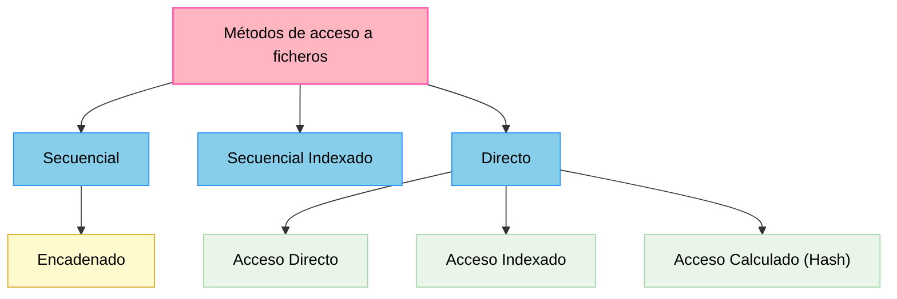

# UD1.- Almacenamiento de la información

## 1.- Introducción

Casi todo lo que nos rodea, en alguna medida, está relacionado con los datos, su almacenamiento y su gestión. El gran volumen de datos que actualmente manejamos y sus innumerables posibilidades requieren de la existencia de técnicos perfectamente formados y capaces de trabajar con ellos.

En esta primera unidad comenzaremos conociendo los primeros sistemas basados en ficheros para el almacenamiento y gestión de la información. Seguidamente, se desarrollarán los conceptos y definiciones básicas relacionadas con las bases de datos, posteriormente analizaremos sus modelos y tipos, un poco más adelante, podremos conocer las características y capacidades de los sistemas gestores de bases de datos y finalmente, identificaremos las herramientas reales con las que llevar a cabo la gestión de dichas bases.

## 2.- Los ficheros de información

### 2.1.- ¿Qué es un fichero?

Un **fichero o archivo** es conjunto de información relacionada, tratada como un todo y organizada de forma estructurada. Es una secuencia de dígitos binarios que organiza información relacionada con un mismo aspecto.

Los ficheros están formados por registros lógicos que contienen datos relativos a un mismo elemento u objeto (por ejemplo, los datos de usuarios de una plataforma educativa). A su vez, los registros están divididos en campos que contienen cada una de las informaciones elementales que forman un registro (por ejemplo, el nombre del usuario o su dirección de correo electrónico).

Los datos están almacenados de tal forma que se puedan añadir, suprimir, actualizar o consultar individualmente en cualquier momento.

Como los ficheros suelen ser muy voluminosos, solo se pueden llevar a la memoria principal partes de ellos para poder procesarlos. La cantidad de información que es transferida entre el soporte en el que se almacena el fichero, y la memoria principal del ordenador, en una sola operación de lectura/grabación, recibe el nombre de **registro físico** o **bloque**.

Normalmente en cada operación de lectura/grabación se transfieren varios registros del fichero, es decir, un bloque suele contener varios registros lógicos. Al número de registros que entran en un bloque se le conoce con el nombre de **factor de blocaje** o **factor de bloqueo**, y a esta operación de agrupar varios registros en un bloque se le llama **bloqueo de registros**.

### 2.2.- Tipos de ficheros

Según la función que vayan a desempeñar los ficheros, éstos pueden ser clasificados de varias maneras.

a. **Ficheros permanentes**: contienen los datos necesarios para el funcionamiento de una aplicación. Se subdividen en:

    - **Ficheros maestros**: contienen el estado actual de los datos que pueden modificarse desde la aplicación. Es la parte central de la aplicación, su núcleo (ej. -> los datos de los usuarios de una plataforma).

    - **Ficheros constantes**: incluyen datos fijos para la aplicación. No suelen ser modificados y se accede a ellos para realización de consultas (ej. -> archivo con códigos postales). 

    - **Ficheros históricos**: contienen datos que fueron considerados como actuales en un periodo o situación anterior. Se utilizan para la reconstrucción de situaciones (ej. -> usuarios que han sido dados de baja en una plataforma). 

b. **Ficheros temporales**: almacenan información útil para una parte de la aplicación, pero no para toda ella. Son generados a partir de datos de ficheros permanentes y tienen un corto periodo de existencia. Se subdividen en:

    - **Ficheros intermedios**: almacenan resultados de una aplicación que serán utilizados por otra.

    - **Ficheros de maniobras**: almacenan datos de una aplicación que no pueden ser mantenidos en memoria principal por falta de espacio.

    - **Ficheros de resultados**: almacenan datos que van a ser transferidos a un dispositivo de salida.

### 2.3.- Los soportes de información

Los ficheros se almacenan en soportes de información manejados por dispositivos periféricos del ordenador, que permiten leer y grabar datos en el soporte. Los soportes más utilizados para almacenar los ficheros son las **cintas magnéticas** y los **discos** (magnéticos, ópticos o magneto-ópticos).

Inicialmente, los primeros sistemas de almacenamiento físico eran tambores de cinta magnética. Tenían unas dimensiones parecidas a los discos de vinilo. Estos tambores funcionaban de manera similar a los antiguos casetes, pero sus mayores dimensiones les permitían almacenar gran cantidad de datos en formato digital, es decir en ceros y unos, en orden secuencial.

Posteriormente, los sistemas de almacenamiento de información comenzaron a cambiar de la mano de los avances en el hardware, en concreto con la aparición del disquete y del disco duro. Eran dispositivos de acceso aleatorio, no siendo necesario en ellos pasar por todos los datos desde el inicio hasta la zona donde se encontraba la información que nos interesaba.

Por tanto, se distinguen dos tipos de soportes para el almacenamiento de datos:

- **De acceso directo** (*ej. -> discos*): el acceso a los datos puede hacerse de forma directa, pudiendo colocarnos en la posición que nos interesa y leer a partir de ella. Son los más usados. 

- **De acceso secuencial** (*ej. -> cintas magnéticas*): si deseamos leer un dato que está en la mitad de la cinta, tendremos que leer todo lo que hay hasta llegar a esa posición. Se suelen usar en copias de seguridad.

### 2.4.- Métodos de acceso

A medida que la tecnología ha ido evolucionando, el acceso a la información contenida en los diferentes tipos de ficheros ha variado mucho. Los objetivos fundamentales de estas modificaciones pueden resumirse en los siguientes puntos:

- Proporcionar un acceso rápido a los registros.  
- Economizar el almacenamiento.  
- Facilitar la actualización de los registros.  
- Permitir que la estructura refleje la organización real de la información.

Las distintas formas de organizar un fichero en un soporte de memoria (también conocido como "*métodos de acceso a los ficheros*"), son: 

A continuación, se detallarán las características de cada uno de estos métodos.

### 2.5.- Fichero secuencial

Sus registros están almacenados de forma contigua de manera que, la única forma de acceder a él, es leyendo un registro tras otro desde el principio hasta el final. En los ficheros secuenciales suele haber una marca indicativa del fin del fichero, que suele denominarse EOF (End of File). Para detectar el final del fichero sólo es necesario encontrar la marca EOF.

Este tipo de ficheros pueden utilizar dispositivos o soportes no direccionables o de acceso secuencial, como son las cintas magnéticas de almacenamiento de datos. También se utiliza en los CD de audio y los DVD de vídeo, en los que la música o las imágenes se almacenan a lo largo de una espiral continua.

Los registros almacenados se identifican por medio de una información ubicada en uno de sus campos. A este campo se le denomina clave o llave. Si se ordena un archivo secuencial por su clave, es más rápido realizar cualquier operación de lectura o escritura.

Características de estos ficheros:

- La lectura siempre se realiza hacia delante.  
- Son monousuario.  
- Tienen una estructura rígida de campos, por lo que todos los registros deben aparecer en orden.  
- El modo de apertura del fichero condiciona la lectura o escritura.  
- Aprovechan al máximo el soporte de almacenamiento al no dejar huecos vacíos.  
- Se pueden grabar en cualquier tipo de soporte, tanto en secuenciales como direccionables.  
- Todos los lenguajes de programación disponen de instrucciones para trabajar con este tipo de ficheros.  
-  No se pueden insertar registros entre los que ya están grabados.

### 2.6.- Fichero de acceso directo o aleatorio

En este tipo de ficheros se puede acceder a un registro indicando la posición relativa del mismo dentro del archivo, o a través de una clave que forma parte del registro como un campo más. Estos archivos deben almacenarse en dispositivos de memoria masiva de acceso directo.

- Campo clave: campo que permite identificar y localizar un registro de manera ágil y organizada.

Cada uno de los registros se guarda en una posición física, que dependerá del espacio disponible en memoria masiva, de ahí que la distribución de los registros sea aleatoria dentro del soporte de almacenamiento. Para acceder a la posición física de un registro se utiliza una dirección o índice, no siendo necesario recorrer todo el fichero para encontrar un determinado registro.

A través de una transformación específica aplicada a la clave, se obtendrá la dirección física en la que se encuentra el registro. Según la forma de realizar esta transformación, existen diferentes modos de acceso:

- **Acceso directo:** la clave lleva directamente a la dirección.
- **Acceso indexado:** la clave lleva a un índice y éste lleva a la dirección.
- **Acceso calculado:** la clave, combinada con una función matemática, nos da la dirección.

En el **acceso directo** la clave coincide con la dirección, debiendo ser numérica y comprendida dentro del rango de valores de las direcciones. Es el método más rápido.

La medida básica de posicionamiento del puntero en el fichero es el byte, dependiendo del tipo de codificación de caracteres que empleemos (Unicode, ANSI) se utilizarán 1 o 2 bytes por carácter respectivamente. Teniendo esto en cuenta, el puntero avanzará de uno en uno o de dos en dos bytes para poder leer o escribir cada carácter.

Características de estos ficheros:

- Posicionamiento inmediato.
- Registros de longitud fija.  
- Apertura del fichero en modo mixto, para lectura y escritura.  
- Son multiusuario.  
- Los registros se borran colocando un cero en la posición que ocupan.  
- Permiten la utilización de algoritmos de compactación de huecos.  
- Los archivos se crean con un tamaño definido (con un máximo de registros establecido durante la creación).  
- Esta organización sólo es posible en soportes direccionables.  
- Se usan cuando el acceso a los datos de un registro se hace siempre empleando la misma clave y la velocidad de acceso a un registro es lo que más nos importa.  
- Permiten la actualización de los registros en el mismo fichero, sin necesidad de copiar el fichero.  
- Permiten realizar procesos de actualización en tiempo real.

### 2.7.- Ficheros indexados

Se basan en la utilización de índices en el almacenamiento de los registros, que permiten el acceso a un registro del fichero de forma directa sin tener que leer los anteriores. Estos índices son similares a los de los libros.

Existirá una zona de registros en la que se encuentran los datos del archivo y una zona de índices, que contiene una tabla con las claves de los registros y las posiciones donde se encuentran los mismos. La tabla de índices estará ordenada por el campo clave.

La tabla de índices será cargada en memoria principal para realizar en ella la búsqueda de la fila correspondiente a la clave del registro a encontrar, obteniéndose así la dirección donde se encuentra el registro. Una vez localizada la dirección, sólo hay que acceder a la zona de registros en el soporte de almacenamiento y posicionarnos en la dirección indicada. Puesto que la tabla debe prever la inclusión de todas las direcciones posibles del archivo, su principal inconveniente resulta determinar su tamaño y mantenerla ordenada por los valores de la clave.

Características de estos ficheros:

- El diseño del registro tiene que tener un campo, o combinación de campos, que permita identificar cada registro de forma única, es decir, que no pueda haber dos registros que tengan la misma información en él. A este campo se le llama campo clave y es el que va a servir de índice. Un mismo fichero puede tener mas de un campo clave, pero al menos uno de ellos no admitirá valores duplicados. Será la clave primaria. A las restantes se les llama claves alternativas.  
- Permiten utilizar el modo de acceso secuencial y el modo de acceso directo para leer la información guardada en sus registros.  
- Para acceder a este tipo de ficheros utilizando el modo de acceso directo se hace conociendo el contenido del campo clave del registro que queremos localizar. Con esa información el sistema operativo puede consultar el índice y conocer la posición del registro dentro del fichero.  
- Para acceder a este tipo de ficheros utilizando el modo de acceso secuencial los registros son leídos ordenados por el contenido del campo clave, independientemente del orden en que se fueron grabando (el orden lógico no es igual al orden físico), debido a que el acceso a los datos se hace a través del índice, que para hacer más fácil la búsqueda de los registros, permanece siempre ordenado por el campo clave.  
- Solamente se puede grabar en un soporte direccionable. Por ejemplo, un disco magnético. Si esto no fuera así, no podría emplear el acceso directo.

### 2.8.- Otros (secuenciales indexados y hash)

**Ficheros secuenciales indexados**

Al igual que en los ficheros indexados, existe una zona de índices y otra zona de registros de datos, pero esta última se encuentra dividida en segmentos (bloques de registros) ordenados.

En la tabla de índices, cada fila hace referencia a cada uno de los segmentos. La clave corresponde al último registro y el índice apunta al registro inicial. Una vez que se accede al primer registro del segmento, dentro de él se localiza (de forma secuencial) el registro buscado.

Esta organización es muy utilizada, tanto para procesos en los que intervienen pocos registros como para aquellos en los que se maneja el fichero completo.

Características de estos ficheros:

- Permite el acceso secuencial. Esto es muy interesante cuando la tasa de actividad es alta. En el acceso secuencial, además, los registros se leen ordenados por el campo clave.  
- Permite el acceso directo a los registros. Realmente emula el acceso directo, empleando para ello las tablas de índices. Primero busca la clave en el área de índices y luego va a leer al área de datos en la dirección que le indica la tabla.  
- Se pueden actualizar los registros en el mismo fichero, sin necesidad de crear un fichero nuevo de copia en el proceso de actualización.  
- Ocupa más espacio en el disco que los ficheros secuenciales, debido al uso del área de índices.  
- Solo se pueden utilizar soportes direccionables.  
- Obliga a una inversión económica mayor, por la necesidad de programas y, a veces, hardware más sofisticado.

**Ficheros de acceso calculado o hash**

La técnica del acceso calculado o hash permite accesos más rápidos, ya que se utiliza una función matemática (*hashing*) que, a partir de la clave, genera la dirección de cada registro del archivo. Si la clave es alfanumérica, deberá previamente ser transformada en un número.

El mayor problema que presenta este tipo de ficheros es que, a partir de diferentes claves se obtenga la misma dirección al aplicar la función matemática o transformación. A este problema se le denomina colisión, y las claves que generan la misma dirección se conocen como sinónimos. Para resolver este problema se aplican diferentes métodos, como tener un bloque de excedentes o zona de sinónimos, o crear un archivo de sinónimos, etc.

Para llevar a cabo la transformación existen multitud de métodos, siendo algunos:

- **Módulo**: la dirección será igual al resto de la división entera entre la clave y el número de registros.  
- **Extracción**: la dirección será igual a una parte de las cifras que se extraen de la clave.

Una buena transformación o función de hash, será aquella que produzca el menor número de colisiones. En este caso hay que buscar una función, a ser posible biunívoca, que relacione los posibles valores de la clave con el conjunto de números correlativos de dirección. Esta función consistirá en realizar una serie de cálculos matemáticos con el valor de la clave hasta obtener un número entre 1 y n, siendo n el número de direcciones que tiene el fichero.

### 2.9.- Parámetros de utilización.

En función del uso que se vaya a dar al fichero, serán adecuados unos tipos u otros de organización. Mediante la utilización de parámetros de referencia, podremos determinar el uso de un fichero. Estos parámetros son:

a. **Capacidad o volumen**: es el espacio, en caracteres, que ocupa el fichero. La capacidad podrá calcularse multiplicando el número previsto de registros por la longitud media de cada registro.

b. **Actividad**: permite conocer la cantidad de consultas y modificaciones que se realizan en el fichero. Para poder especificar la actividad se deben tener en cuenta:
    - **Tasa de consulta o modificación**: que es el porcentaje de registros consultados o modificados en cada tratamiento del fichero, respecto al número total de registros contenidos en él.
    - **Frecuencia de consulta o modificación**: número de veces que se accede al fichero para hacer una consulta o modificación en un periodo de tiempo fijo.

c. **Volatilidad**: mide la cantidad de inserciones y borrados que se efectúan en un fichero. Para determinar la volatilidad es necesario conocer:
    - **Tasa de renovación**: es el tanto por ciento de registros renovados en cada tratamiento del fichero, respecto al número total de registros contenidos en él.
    - **Frecuencia de renovación**: es el número de veces que se accede al fichero para renovarlo en un periodo de tiempo fijo.

d. **Crecimiento**: es la variación de la capacidad del fichero y se mide con la tasa de crecimiento, que es el porcentaje de registros en que aumenta el fichero en cada tratamiento.

## 3.- Bases de datos

Si las aplicaciones, al ser diseñadas, deben depender directamente de sus ficheros o archivos, se pierde independencia y surgen serios inconvenientes (información duplicada, incoherencia de datos, fallos de seguridad, etc). Para solucionarlo, aparecen las bases de datos. 

Una base de datos permitirá reunir toda la información relacionada en un único sistema de almacenamiento, pudiendo cualquier aplicación utilizarla de manera independiente y ofreciendo una mejora en el tratamiento de la información, así como una evolución para el desarrollo de aplicaciones.

### 3.1.- Conceptos

**Base de datos**: colección de datos relacionados lógicamente entre sí, con una definición y descripción comunes y que están estructurados de una determinada manera. Es un conjunto estructurado de datos que representa entidades y sus interrelaciones, almacenados con la mínima redundancia y posibilitando el acceso a ellos eficientemente por parte de varias aplicaciones y usuarios.

La base de datos no sólo contiene los datos de la organización, también almacena una descripción de dichos datos. Esta descripción es lo que se denomina **metadatos**, se almacena en el **diccionario de datos** o **catálogo** y es lo que permite que exista **independencia de datos** lógica-física.

Una base de datos constará de:

- **Entidades**: objeto real o abstracto con características diferenciadoras de otros, del que se almacena información en la base de datos. (ej. -> perro).
- **Atributos**: datos que se almacenan de la entidad. Cualquier propiedad o característica de una entidad puede ser atributo. (ej. -> raza).
- **Registros**: donde se almacena la información de cada entidad. Es un conjunto de atributos que contienen los datos que pertenecen a una misma repetición de entidad (ej. -> labrador).
- **Campos**: donde se almacenan los atributos de cada registro (ej. -> valor "labrador").

Ventajas del uso de bases de datos:

- **Acceso múltiple**: diversos usuarios o aplicaciones podrán acceder a la base de datos.  
- **Utilización múltiple**: cada uno de los usuarios o aplicaciones podrán disponer de una visión particular de la estructura de la base de datos, de tal manera que cada uno de ellos accederá sólo a la parte que realmente le corresponde.  
- **Flexibilidad**: la forma de acceder a la información puede ser establecida de diferentes maneras, ofreciendo tiempos de respuesta muy reducidos.  
- **Confidencialidad y seguridad**: el control del acceso a los datos podrá ser establecido para que unos usuarios o aplicaciones puedan acceder a unos datos y a otros no, impidiendo a los usuarios no autorizados la utilización de la base de datos.  
- **Protección contra fallos**: en caso de errores en la información, existen mecanismos bien definidos que permiten la recuperación de los datos de forma fiable.  
- **Independencia física**: un cambio de soporte físico de los datos (por ejemplo: el tipo de discos), no afectaría a la base de datos o a las aplicaciones que acceden a ellos.  
- **Independencia lógica**: los cambios realizados en la base de datos no afectan a las aplicaciones que la usan.  
- **Redundancia**: los datos se almacenan, por lo general, una única vez. Aunque si es necesario, podríamos repetir información de manera controlada.  
- **Interfaz de alto nivel**: mediante la utilización de lenguajes de alto nivel puede utilizarse la base de datos de manera sencilla y cómoda.  
- **Consulta directa**: existe una herramienta para poder acceder a los datos interactivamente.

### 3.2.- Usos