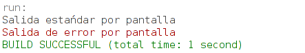
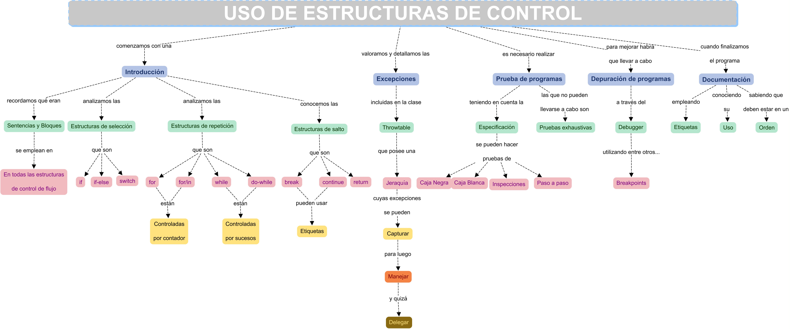

## **UD1.- Introducción a la programación**


### 1.- Introducción

En esta primera unidad realizaremos un recorrido por los conceptos fundamentales de la programación de aplicaciones. Iniciaremos nuestro camino conociendo con qué vamos a trabajar, qué técnicas podemos emplear y qué es lo que pretendemos conseguir. Continuaremos con el análisis de las diferentes formas de programación existentes, identificaremos qué fases conforman el desarrollo de una aplicación software y avanzaremos detallando las características relevantes de cada uno de los lenguajes de programación disponibles, para posteriormente, realizar una visión general del lenguaje de programación Java. Finalmente, tendremos la oportunidad de conocer con qué herramientas podríamos desarrollar nuestros programas, escogiendo entre una de ellas para ponernos manos a la obra utilizando el lenguaje Java.

### 2.- Programas y programación
#### 2.1.- Buscando una solución

Como en la vida real, la búsqueda y obtención de una solución a un problema determinado, utilizando medios informáticos, se lleva a cabo siguiendo unos pasos fundamentales.

**Resolución de problemas**

| En la vida real | En programación |
|----------|----------|
| Observación de la situación o problema | **Análisis del problema**: requiere que el problema sea definido y comprendido claramente para que pueda ser analizado con todo detalle |
| Pensamos en una o varias posibles soluciones | **Diseño o desarrollo de algoritmos**: se aplican diferentes técnicas y principios para establecer de forma detallada los pasos a seguir para resolver el problema |
| Aplicamos la solución que estimamos más adecuada | **Resolución del algoritmo elegido:** consiste en convertir el algoritmo en programa, ejecutarlo y comprobar que soluciona verdaderamente el problema |

**¿Qué virtudes debería tener nuestra solución?**

Resolver el problema adecuadamente, en un tiempo mínimo y con un uso óptimo de los recursos del sistema. Para conseguirlo, cuando afrontemos la construcción de la solución tendremos que tener en cuenta los siguientes conceptos:

1. **Abstracción:** se trata de realizar un análisis del problema para descomponerlo en problemas más pequeños y de menor complejidad, describiendo cada uno de ellos de manera precisa.

2. **Encapsulación:** consiste en ocultar la información que manejan de los diferentes elementos que forman el sistema.

3. **Modularidad:** se trata de dividir el proyecto en módulos independientes, donde cada uno de ellos tendrá su función correspondiente.

#### 2.2.- Algoritmos y programas

Después de analizar en detalle el problema a solucionar, hemos de diseñar y desarrollar el **algoritmo** adecuado. Un **algoritmo** es secuencia ordenada de pasos, descrita sin ambigüedades, que conducen a la solución de un problema dado. Éstos son independientes de los lenguajes de programación y de los ordenadores donde se ejecutan.

La diferencia entre algoritmo y programa es que, en el segundo, los pasos que permiten resolver el problema deben escribirse en un determinado lenguaje de programación para que puedan ser ejecutados en el ordenador y así obtener la solución.

Características que un algoritmo debe cumplir:

- Ser preciso e indicar el orden de realización paso a paso.  
- Estar definido, si se ejecuta dos o más veces con los mismos datos de entrada, debe obtener el mismo resultado cada vez. Además, debe dar una respuesta a cualquier dato de entrada.  
- Tener un número finito de pasos.

Para representar gráficamente los algoritmos, podemos utilizar diferentes herramientas:

- **Diagramas de flujo:** utiliza símbolos gráficos para la representación del algoritmo. Suele utilizarse en las fases de análisis.  
- **Pseudocódigo:** se basa en el uso de palabras clave en lenguaje natural, constantes, variables, otros objetos, instrucciones y estructuras de programación que expresan de forma escrita la solución del problema. Es la técnica más utilizada.  
- **Tablas de decisión:** en una tabla son representadas las posibles condiciones del problema con sus respectivas acciones. Suele ser una técnica de apoyo al pseudocódigo cuando existen situaciones condicionales complejas.

### 3.- Paradigmas de la programación

Un **Paradigma de programación** es un modelo básico para el diseño y la implementación de programas. Este modelo determinará como será el proceso de diseño y la estructura final del programa. Algunos de ellos son:

- **Programación declarativa:** se basa en el desarrollo de algoritmos aplicando una especificación de un conjunto de condiciones, proposiciones, afirmaciones y restricciones que describen el problema. Las sentencias utilizadas describen el problema que se quiere solucionar, pero no la instrucciones necesarias para llegar a la solución (ej. SQL). Dentro de este paradigma, se encuentran la **programación funcional** y la **programación lógica**. 
- **Programación imperativa:** se basa en el desarrollo de algoritmos detallando de forma clara y específica los comandos a ejecutar para, a través del paso por diferentes estados,  llegar a la solución. Se basa en el uso de variables, tipos de datos, expresiones y estructuras de control del flujo de ejecución (ej. Python, Java...). Dentro de este paradigma se encuentran la **programación no estructurada**, la **programación estructurada**, la **programación orientada a objetos**, la **programación orientada a eventos**...

Puede haber lenguajes de programación que no se clasifiquen únicamente dentro de uno de ellos.

El objetivo que se busca con la aplicación de diferentes enfoques, es el de reducir la dificultad para el desarrollo y mantenimiento de las aplicaciones, mejorar el rendimiento del programador y mejorar la productividad y calidad de los programas.

### 4.- Fases de la programación

Sea cual sea el estilo que escojamos a la hora de automatizar una determinada tarea, debemos realizar el proceso aplicando un método a nuestro trabajo.

El proceso de creación de software puede dividirse en diferentes fases:

1. Resolución del problema.
2. Implementación.
3. Explotación y mantenimiento.

#### 4.1.- Resolución del problema

Para el comienzo de esta fase, es necesario que el problema sea definido y comprendido claramente para que pueda ser analizado con todo detalle. A su vez, la fase de resolución del problema puede dividirse en dos etapas:

a. **Análisis**

    El análisis indicará la especificación de requisitos que se deben cubrir. Se especificarán los procesos y estructuras de datos que se van a emplear. La creación de prototipos será muy útil para saber con mayor exactitud los puntos a tratar.

    El análisis inicial ofrecerá una idea general de lo que se solicita, realizando posteriormente sucesivos refinamientos que servirán para dar respuesta a las siguientes cuestiones:
        
    - ¿Cuál es la información que ofrecerá la resolución del problema?
    - ¿Qué datos son necesarios para resolver el problema? 

b. **Diseño**

    En esta etapa se convierte la especificación realizada en la fase de análisis en un diseño más detallado, indicando el comportamiento o la secuencia lógica de instrucciones capaz de resolver el problema planteado. Estos pasos sucesivos, que indican las instrucciones a ejecutar por la máquina, constituyen el algoritmo.

    Durante la fase de diseño, se plantea la aplicación a desarrollar como una única operación global, y se va descomponiendo en operaciones más sencillas, detalladas y específicas. El nivel de descomposición dependerá del tamaño del problema. En cada nivel de refinamiento, las operaciones identificadas se asignan a módulos separados.

    Hay que tener en cuenta que antes de pasar a la implementación del algoritmo, hemos de asegurarnos que tenemos una solución adecuada. Para ello, todo diseño requerirá de la realización de la **prueba** o **traza del programa**. Este proceso consistirá en un seguimiento paso a paso de las instrucciones del algoritmo utilizando datos concretos. Si la solución aportada tiene errores, tendremos que volver a la fase de análisis para realizar las modificaciones necesarias o tomar un nuevo camino para la solución. Sólo cuando el algoritmo cumpla los requisitos y objetivos especificados en la fase de análisis se pasará a la fase de implementación.

#### 4.2.- Implementación

Si la fase de resolución del problema requiere un especial cuidado en la realización del análisis y el posterior diseño de la solución, la fase de implementación cobra también una especial relevancia. Llevar a la realidad nuestro algoritmo implicará cubrir algunas etapas más que se detallan a continuación.

a. **Codificación**

    Esta etapa consiste en transformar o traducir los resultados obtenidos a un determinado lenguaje de programación. Para comprobar la calidad y estabilidad de la aplicación se han de realizar una serie de pruebas que comprueben las funciones de cada módulo (pruebas unitarias), que los módulos funcionan bien entre ellos (pruebas de interconexión) y que todos funcionan en conjunto correctamente (pruebas de integración).

    Cuando realizamos la traducción del algoritmo al lenguaje de programación debemos tener en cuenta las reglas gramaticales y la sintaxis de dicho lenguaje. Obtendremos entonces el código fuente, lo que normalmente conocemos por programa.

    Pero para que nuestro programa comience a funcionar, antes debe ser traducido a un lenguaje que la máquina entienda. Este proceso de traducción puede hacerse de dos formas, compilando o interpretando el código del programa.

Compilación: Es el proceso por el cual se traducen las instrucciones escritas en un determinado lenguaje de programación a lenguaje que la máquina es capaz de interpretar, nomalmente código binario.

El proceso de compilación se puede llevar a cabo de dos formas:

    A través de un compilador: programa informático que realiza la traducción. Recibe el código fuente, realiza un análisis lexicográfico, semántico y sintáctico, genera un código intermedio no optimizado, optimiza dicho código y finalmente, genera el código objeto/máquina ejecutable en una plataforma específica.
    A través de un Intérprete: programa informático capaz de analizar y ejecutar otros programas, escritos en un lenguaje de alto nivel. Los intérpretes se diferencian de los compiladores en que mientras éstos traducen un programa escrito en un lenguaje de programación al código de máquina del sistema, los intérpretes sólo realizan la traducción a medida que sea necesaria, típicamente, instrucción por instrucción, y normalmente no guardan el resultado de dicha traducción.

Una vez traducido, sea a través de un proceso de compilación o de interpretación, el programa podrá ser ejecutado.

b. **Prueba de ejecución y validación**

    Para esta etapa es necesario implantar la aplicación en el sistema donde va a funcionar, debe ponerse en marcha y comprobar si su funcionamiento es correcto. Utilizando diferentes datos de prueba se verá si el programa responde a los requerimientos especificados, si se detectan nuevos errores, si éstos son bien gestionados y si la interfaz es amigable. Se trata de poner a prueba nuestro programa para ver su respuesta en situaciones difíciles.

    Mientras se detecten errores y éstos no se subsanen no podremos avanzar a la siguiente fase. Una vez corregido el programa y testeado se documentará mediante:
    - Documentación interna: Encabezados, descripciones, declaraciones del problema y comentarios que se incluyen dentro del código fuente.
    - Documentación externa: Son los manuales que se crean para una mejor ejecución y utilización del programa.

#### 4.3.- Explotación

Cuando el programa ya está instalado en el sistema y está siendo de utilidad para los usuarios, decimos que se encuentra en fase de explotación.

Periódicamente será necesario realizar evaluaciones y, si es necesario, llevar a cabo modificaciones para que el programa se adapte o actualice a nuevas necesidades, pudiendo también corregirse errores no detectados anteriormente. Este proceso recibe el nombre de mantenimiento del software.

Será imprescindible añadir una documentación adecuada que facilite al programador la comprensión, uso y modificación de dichos programas.

### 5.- Ciclo de vida del software

El ciclo de vida del software es una sucesión de estados o fases por las cuales pasa un software a lo largo de su vida. El proceso de desarrollo involucra las siguientes etapas:

1. Especificación y Análisis de requisitos.
2. Diseño.
3. Codificación.
4. Pruebas.
5. Instalación y paso a Producción.
6. Mantenimiento.

### 6.- Lenguajes de programación

Un **lenguaje de programación** es un conjunto de reglas sintácticas y semánticas, símbolos y palabras especiales establecidas para la construcción de programas.

Cada lenguaje de programación se basa en una **gramática**, que es un conjunto de reglas aplicables al conjunto de símbolos y palabras especiales del lenguaje de programación para la construcción de sentencias correctas. Esta gramática dispone de:

1. **Léxico**: conjunto finito de símbolos y palabras especiales (vocabulario del lenguaje).
2. **Sintaxis**: posibles combinaciones de los símbolos y palabras especiales (forma de los programas).
3. **Semántica**: significado de cada construcción del lenguaje (acción que se llevará a cabo).

Pueden existir sentencias sintácticamente correctas, pero semánticamente incorrectas. Una característica relevante de los lenguajes de programación es que más de un programador pueda usar un conjunto común de instrucciones que sean comprendidas entre ellos. A través de este conjunto se puede lograr la construcción de un programa de forma colaborativa.

Los lenguajes de programación pueden ser clasificados en función de lo cerca que estén del lenguaje humano o del lenguaje de los ordenadores.

#### 6.1.- Lenguaje máquina

Lenguaje utilizado directamente por el procesador, que consta de un conjunto de instrucciones codificadas en binario. Es el sistema de códigos directamente interpretable por un circuito microprogramable.

Fue el primer lenguaje utilizado para la programación, cada máquina tenía su propio conjunto de instrucciones codificadas en ceros y unos. Cuando un algoritmo está escrito en este tipo de lenguaje, decimos que está en código máquina.

Programar en este tipo de lenguaje presenta los siguientes inconvenientes:

- Cada programa es válido sólo para un tipo de procesador.
- La lectura o interpretación de los programas es extremadamente difícil.
- Los programadores deben memorizar largas combinaciones de ceros y unos.
- Los programadores se encargaban de introducir los códigos binarios en el computador, lo que provocaba largos tiempos de preparación y posibles errores.

Dada su complejidad, fue sustituido por otros lenguajes más sencillos. A pesar de ello, todos los programas deben ser traducidos al lenguaje máquina para para poder ser ejecutados.

#### 6.2.- Lenguaje ensamblador

Es la evolución del lenguaje máquina. Las instrucciones ya no son secuencias binarias, se sustituyen por códigos de operación que describen una operación elemental del procesador. Es un lenguaje de bajo nivel, al igual que el lenguaje máquina, ya que dependen directamente del hardware donde son ejecutados. Normalmente, una instrucción en ensamblador se corresponde con una instrucción de lenguaje máquina.

Mnemotécnico: palabras especiales que sustituyen largas secuencias de ceros y unos, utilizadas para referirse a diferentes operaciones disponibles. En ensamblador, cada instrucción (mnemotécnico) se corresponde a una instrucción del procesador. 

Este lenguaje presenta múltiples dificultades:

- Los programas siguen dependiendo directamente del hardware que los soporta.
- Los programadores deben conocer detalladamente la máquina sobre la que programaban.
- La lectura, interpretación o modificación de los programas sigue siendo difícil.

Todo programa escrito en lenguaje ensamblador necesita de un **intermediario** que realice la traducción de cada una de las instrucciones que componen su código al lenguaje máquina correspondiente. Este intermediario es el **programa ensamblador**. El programa original escrito en lenguaje ensamblador constituye el código fuente y el programa traducido al lenguaje máquina se conoce como programa objeto que será directamente ejecutado por la computadora.

#### 6.3.- Lenguajes compilados

Nacieron para paliar los problemas derivados del lenguaje ensamblador. Algunos ejemplos son Pascal, Fortran, Algol, C, C++, etc.

Al ser lenguajes más cercanos al humano, también se les denomina lenguajes de alto nivel. Son más fáciles de utilizar y comprender, las instrucciones que forman parte de estos lenguajes utilizan palabras y signos reconocibles por el programador.

Ventajas:

- Mucho más fáciles de aprender y de utilizar.
- Reducción de tiempo y costes para desarrollar programas.
- Son independientes del hardware, los programas pueden ejecutarse en diferentes tipos de máquina.
- La lectura, interpretación y modificación de los programas es mucho más sencilla.

Desventajas:

- El código objeto generado es menos eficiente que el código generado en lenguaje ensamblador, a pesar de que los compiladores realizan procesos de optimización del código.
- Un programa escrito en un lenguaje de alto nivel también tiene que traducirse a un código que pueda utilizar la máquina. Los programas traductores que realizan esta operación se llaman **compiladores**.

**Compilador**: programa cuya función consiste en traducir el código fuente de un programa escrito en un lenguaje de alto nivel a lenguaje máquina.

El compilador realizará la traducción y además informará de los posibles errores. Una vez subsanados, se generará el programa traducido a código máquina, conocido como **código objeto**. Este programa aún no podrá ser ejecutado hasta que no se le añadan los módulos de enlace o bibliotecas, durante el proceso de **enlazado**. Una vez finalizado el enlazado, se obtiene el código ejecutable.

#### 6.4.- Lenguajes interpretados

Su ejecución se realiza a través de un **intérprete**. Cada instrucción escrita en un lenguaje interpretado se analiza, traduce y ejecuta tras haber sido verificada. Una vez realizado el proceso por el intérprete, la instrucción se ejecuta, pero no se guarda en memoria.

**Intérprete**: programa traductor de un lenguaje de alto nivel en el que el proceso de traducción y de ejecución se llevan a cabo simultáneamente, es decir, la instrucción se pasa a lenguaje máquina y se ejecuta directamente. No se genera programa objeto, ni programa ejecutable.

Los lenguajes interpretados generan programas de menor tamaño que los generados por un compilador, al no guardar el programa traducido a código máquina. Pero son más lentos, ya que han de ser traducidos durante su ejecución. Por otra parte, necesitan disponer en la máquina del programa intérprete ejecutándose, algo que no es necesario en el caso de un programa compilado, para los que sólo es necesario tener el programa ejecutable para poder utilizarlo.

Ejemplos de lenguajes interpretados son Perl, PHP, Python, JavaScript, etc.

A medio camino entre los lenguajes compilados y los interpretados, existen los lenguajes que podemos denominar **pseudo-compilados** o **pseudo-interpretados**, es el caso de Java. Java puede verse como compilado e interpretado a la vez, ya que su código fuente se compila para obtener el código binario en forma de bytecodes, que son estructuras parecidas a las instrucciones máquina, con la importante propiedad de no ser dependientes de ningún tipo de máquina (se detallarán más adelante). Los ficheros que contienen los bytecodes de Java tienen extensión .class. La Máquina Virtual Java se encargará de interpretar este código y, para su ejecución, lo traducirá a código máquina del procesador en particular sobre el que se esté trabajando.

### 7.- El lenguaje de programación Java

#### 7.1.- ¿Qué y cómo es Java?

Java es un lenguaje de **programación orientado a objetos (POO)**. Fue creado para solucionar problemas que los lenguajes anteriores, como C, no podían manejar eficientemente, especialmente con el crecimiento del volumen del código.

La principal virtud de Java es su **independencia del *hardware***. El código se escribe una sola vez y se puede ejecutar en **cualquier plataforma** gracias a la **Java Virtual Machine (JVM)**. La JVM interpreta el código (llamado *bytecode*) y lo convierte en código específico para el sistema operativo donde se ejecuta.

**Características de Java**

- **Orientado a objetos**: se basa en la división de problemas en objetos con propiedades e interacciones, simplificando el desarrollo.
- **Independiente de la arquitectura**: el *bytecode* generado es universal.
- **Sintaxis**: similar a C y C++.
- **Robustez y seguridad**: realiza comprobaciones del código y restringe el acceso a áreas de memoria delicadas.
- **Distribuido**: preparado para aplicaciones de red (TCP/IP).
- **Bibliotecas**: dispone de un amplio conjunto de estas.

#### 7.2.- Breve historia

Java surgió en **1991** en **Sun Microsystems** con el objetivo de crear un lenguaje independiente del dispositivo, inicialmente para pequeños electrónicos. Se renombró a **Java** en **1995** y se lanzó al público como lenguaje para computadoras. Su filosofía de **independencia de plataforma**, potencia, POO y facilidad para aplicaciones de red lo catapultaron a la popularidad. Un punto clave fue su integración en el navegador **Netscape Navigator 2.0**.

La plataforma Java (Java 2 o posterior) incluye:

1.  El lenguaje de programación Java.
2.  **Java Core:** Un conjunto de bibliotecas estándar.
3.  **Herramientas de Desarrollo (JDK):** Incluye el compilador de *bytecodes*, el depurador, etc.
4.  **Entorno de Ejecución (JRE):** La máquina virtual (JVM) que ejecuta el *bytecodes*.

ariantes de la Plataforma Java:V

* **J2SE (Standard Edition):** Para aplicaciones de escritorio y servidores.
* **J2EE (Enterprise Edition):** Para aplicaciones web empresariales y del lado del servidor.
* **Java FX:** Para crear Aplicaciones de Internet Enriquecidas (RIAs) con interfaz multiplataforma.
* **Java Embedded/Card:** Para sistemas embebidos, IoT, y tarjetas inteligentes, respectivamente.

#### 7.3.- La POO y Java

En Java, el código (**métodos**) y los datos (**estado**) se agrupan en **objetos**. Un objeto es una entidad con comportamiento y estado que permite la **reutilización de código**, reduciendo el tiempo de desarrollo.

* **Clases e Instancias:** Los patrones o tipos de objetos se llaman **clases**, y los objetos creados a partir de ellas son **instancias**.
* **Modelo de Construcción:** La POO funciona como unir "bloques de construcción" (objetos pequeños) para crear estructuras más grandes (programas). 
* **Pilares de la POO:** Java incorpora los tres conceptos principales de la POO:
    * **Encapsulación:** Consiste en ocultar el estado (datos) de un objeto para que solo pueda ser modificado mediante sus operaciones (métodos) definidas. Esto aísla y protege los datos.
    * **Herencia:** Permite que una clase nueva (derivada) extienda la funcionalidad de otra (clase base o superclase), especializándola.
    * **Polimorfismo:** Es la capacidad de que varias clases derivadas de una misma clase base implementen un mismo método de manera diferente (ej. un método `mover` funciona distinto para un pez que para un ave).

#### 7.4.- Independencia de la plataforma y trabajo en red

Java se distingue por estas dos características:

* **Independencia de la Plataforma:** Los programas de Java son ejecutables en **cualquier tipo de *hardware***.
    * El código fuente se compila en **Java Bytecode** (instrucciones simplificadas).
    * Este *bytecode* es interpretado y ejecutado por la **Máquina Virtual Java (JVM)**.
    * La JVM es la única parte dependiente del sistema, ya que está escrita en código nativo de la plataforma.
* **Trabajo en Red:** Java ofrece amplias posibilidades para la comunicación **vía TCP/IP**. Dispone de librerías que facilitan la interacción con protocolos como `http` y `ftp`, simplificando las tareas de programación en red.


#### 7.5.- Seguridad y simplicidad

Además de su independencia de plataforma y capacidad de red, Java es popular por dos virtudes clave:

**1. Seguridad**

- **Eliminación de Accesos Peligrosos:** Prohíbe el acceso a zonas de memoria "sensibles".
- **Verificación de Código:** El *bytecode* es rigurosamente comprobado y verificado para garantizar que todas las operaciones, conversiones y usos de clases sean seguras y no produzcan efectos no deseados.
- **Restricciones:** Java restringe la apertura de archivos locales, la ejecución de aplicaciones nativas de la plataforma y el uso de la máquina como puente para operaciones externas.

Java implementa varias capas de *tests* y restricciones para garantizar un **entorno seguro**.

**2. Simplicidad**

- **Simplificación del Código:** Se eliminaron elementos complejos y propensos a errores presentes en C/C++, como:
    * La aritmética de **punteros**.
    * La gestión manual de la memoria.
    * Los registros y la definición manual de tipos.
- **Gestión Automática de Memoria (Garbage Collector):**
    * Java incluye un **Recolector de Basura (*Garbage Collector*)** que libera al programador de la tarea de gestionar la memoria.
    * Cuando un objeto ya no se utiliza, el entorno Java lo borra automáticamente. Esto permite la reutilización de bloques de memoria y disminuye la **fragmentación de memoria**.

#### 7.6.- Java y los Bytecodes

El código Java logra su independencia de la plataforma gracias a un proceso de dos fases que involucra los **Bytecodes** y la **Máquina Virtual Java (JVM)**.

**1. Generación de Bytecodes**

1.  El código fuente de Java (archivos `.java`) se **precompila**.
2.  El resultado son los **Bytecodes** (archivos `.class`), que son un conjunto de instrucciones de lenguaje máquina **no específicas** de ningún procesador o sistema.

**2. Ejecución a través de la JVM**

- Los Bytecodes deben ser interpretados por la **Máquina Virtual Java (JVM)**.
- La JVM es el intérprete específico para cada plataforma (Windows, Linux, etc.) y se encarga de traducir los Bytecodes a **código nativo** que el *hardware* pueda ejecutar. 
- **Verificación de Seguridad:** Antes de ejecutar, la JVM utiliza un verificador de Bytecodes para asegurar la **integridad del sistema**, comprobando que el código cumple las especificaciones, evita desbordamientos de memoria y realiza operaciones seguras.

En conclusión, para ejecutar un programa Java en cualquier sistema, solo es necesario que este cuente con la JVM adecuada. Este mecanismo es el que garantiza la famosa portabilidad de Java.

### 8.- Programas en Java

#### 8.1.- Estructura de un programa

Todo programa en Java, al ser un lenguaje orientado a objetos, se construye alrededor de clases.

| Elemento | Descripción Clave | Ejemplo |
| :--- | :--- | :--- |
| `public class Clase_Principal` | Es la clase principal que contiene todo el programa. Solo una puede ser `public`. El nombre del archivo (`.java`) debe coincidir con el nombre de esta clase. | `public class MiApp { ... }` |
| `public static void main (String[] args)` | Es el método principal de la aplicación, el primero en ejecutarse. | `main` |
| Bloques de Código | Conjuntos de instrucciones agrupados. Definen el alcance de la clase o método. | `{ instrucciones }` |
| Punto y Coma (`;`) | Es obligatorio. Marca el final de cada instrucción de código. | `System.out.println("Hola");` |
| Comentarios | Anotaciones ignoradas por el compilador, usadas para aclaraciones. | `// Comentario de una línea` o `/* Comentario de bloque */` |

#### 8.2.- El entorno básico de desarrollo Java

Para llevar a la práctica la programación en Java, se requieren herramientas específicas.

- **Java Development Kit (JDK)**. Es el entorno básico y gratuito para construir aplicaciones, *applets* y componentes en Java, cuya función es proveer las herramientas para el desarrollo y prueba de programas. Incluye el **compilador** y el **intérprete**, herramientas esenciales para la precompilación y ejecución del código. 

- **Java Runtime Environment (JRE)**. El JDK incluye una implementación del **JRE**, que es la base para la ejecución de los programas Java, ya que incluye la **Máquina Virtual Java (JVM)**, bibliotecas de clases necesarias y otros archivos de soporte.

En resumen, el **JDK** permite **desarrollar** el programa, y el **JRE** (que viene dentro del JDK) permite **ejecutarlo** en cualquier plataforma mediante la **JVM**.

#### 8.3.- La API de Java

Para acelerar el desarrollo de software, Java incluye un amplio conjunto de bibliotecas. La **API de Java** es una biblioteca de clases orientada a objetos incluida en el **JDK**, que proporciona funcionalidades ya hechas y organizadas en paquetes, permitiendo a los programadores desarrollar programas más rápido mediante la reutilización de código.

#### 8.4.- Afinando la configuración

Para que un sistema operativo pueda compilar y ejecutar programas Java desde la línea de comandos, es necesario realizar ajustes en las variables de entorno para que el sistema sepa dónde encontrar los archivos esenciales.

- **La variable `PATH`**. Le indica al sistema operativo dónde encontrar los programas ejecutables (`javac.exe` para compilar y `java.exe` para ejecutar) cuando se usan desde la línea de comandos. Se debe incluir en esta variable la ruta exacta donde se instaló el **JDK** hasta su directorio `bin`.

- **La variable `CLASSPATH`**. Define las rutas donde el **JDK** debe buscar las **clases** necesarias para ejecutar o compilar un programa. Estas clases incluyen las bibliotecas de la **API de Java** y las clases creadas por el usuario. Las rutas pueden incluir directorios o archivos comprimidos en formato `zip` o `jar` que contengan archivos `.class`. Si esta variable no existe en el sistema, debe ser creada.

#### 8.5.- Codificación, compilación y ejecución de aplicaciones

Una vez que el código fuente de un programa Java está escrito (archivo con extensión `.java`) y el entorno configurado, el proceso para obtener una aplicación ejecutable sigue tres pasos básicos.

**1. Codificación**

Se escribe el código fuente en uno o varios archivos que tienen la extensión **`.java`**.

**2. Compilación**

- Se utiliza el compilador **`javac`**  incluido en el JDK. 
- Se ejecuta desde la línea de comandos usando: `javac archivo.java`
- Si no hay errores, el compilador genera un archivo con el mismo nombre y la extensión **`.class`**. Este archivo contiene el **Bytecode** (código precompilado).
- Si el código fuente tiene múltiples clases, se generará **un archivo `.class` por cada clase**.
- Si el compilador detecta errores, los muestra en el terminal. El programador debe corregirlos antes de que se genere el archivo `.class`.

**3. Ejecución**

- Se utiliza el intérprete **`java`** incluido en el JDK.
- La ejecución solo es posible si el archivo contiene el método **`main`**.
- Se ejecuta desde la línea de comandos usando: `java archivo` (se omite la extensión `.class`).

En resumen: se escribe el código (`.java`), se usa **`javac`** para convertirlo en **Bytecode** (`.class`), y finalmente se usa **`java`** para que el intérprete ejecute la aplicación.

#### 8.6.- Tipos de aplicaciones en Java

| Tipo de Aplicación | Descripción y Características Clave |
| :--- | :--- |
| Aplicaciones de consola | Programas independientes que se ejecutan invocando la **JVM**. Carecen de Interfaz Gráfica de Usuario (GUI); leen y escriben a la entrada/salida estándar. Deben incluir obligatoriamente el método **`main`**. |
| Aplicaciones gráficas | Programas independientes que utilizan bibliotecas con capacidades gráficas (como **Swing**) para crear una GUI. También requieren el método **`main`**. |
| Applets | Programas pequeños incrustados en **páginas web** y que se ejecutan en el navegador del **cliente**. No tienen método `main`. Tienen restricciones de seguridad. |
| Servlets | Componentes del lado del **servidor** (Java EE). Están diseñados para desarrollar aplicaciones web que interactúan con las peticiones recibidas de los clientes. |
| Midlets | Aplicaciones creadas específicamente para la máquina virtual **Java Micro Edition (Java ME)**, destinadas a sistemas de propósito simple o **dispositivos móviles**. |

### 9.- Entornos Integrados de Desarrollo (IDE)

#### 9.1.- ¿Qué son?

Un Entorno Integrado de Desarrollo (IDE) es una aplicación que centraliza todas las herramientas necesarias para el desarrollo de software en un solo programa, ofreciendo una interfaz gráfica amigable. Ofrece funcionalidades que mejoran la productividad, como código fuente coloreado, plantillas y gestión de proyectos.

El IDE es solo una "fachada", ya que **requiere tener instalado el compilador (JDK)** para funcionar. Sin el compilador subyacente, el IDE no puede construir ni ejecutar el programa.

#### 9.2.- IDE's actuales

Existe una amplia variedad de IDEs, tanto gratuitos como de pago. Los más utilizados por la comunidad de programadores Java son **Eclipse**, **IntelliJ IDEA** y **NetBeans**.

| Licencia | Ejemplos |
| :--- | :--- |
| Gratuitos | NetBeans, Eclipse, BlueJ, Jgrasp, Jcreator LE |
| De pago | IntelliJ IDEA, Jbuilder, Jcreator, JDeveloper |

#### 9.3.- El entorno NetBeans

**1. Características**

- Inicialmente centrado en Java, aunque soporta otros lenguajes (C, C++, PHP, Javascript, etc.).
- Proyecto de código abierto de gran éxito, libre y gratuito , con el apoyo de una gran comunidad y empresas.
- Desde su origen como el primer IDE escrito en Java, ha competido con Eclipse para ser la plataforma principal de desarrollo Java.

**2. Capacidades**

- Permite escribir código para diversos lenguajes además de Java.
- Facilita la creación de aplicaciones J2EE al incorporar servidores de aplicaciones (como Glassfish y Tomcat).
- Permite crear aplicaciones Swing de manera sencilla, similar al estilo de otros IDEs visuales.
- Capacidad para crear aplicaciones JME (Java Micro Edition) para dispositivos móviles.

**3. Arquitectura Modular**

- Las aplicaciones en NetBeans se desarrollan a partir de componentes llamados módulos. Un módulo es un archivo Java que contiene clases escritas para interactuar con las APIs de NetBeans.
- Esta arquitectura modular permite que las aplicaciones se extiendan fácilmente con la adición de nuevos módulos desarrollados independientemente.

#### 9.5.- Aspecto del entorno y gestión de proyectos

La vista `Archivos` de NetBeans muestra la estructura del proyecto.

- `src`: contiene el código fuente (.java).
- `build`: contiene los archivos compilados (.class) listos para ejecutar.
- El resto de archivos son de configuración interna de NetBeans y no deben borrarse.

## **UD2.- Creación de mi primer programa**


### 1. Introducción

Los programas de ordenador son aplicaciones que **resuelven problemas** mediante la ejecución de tareas específicas, como usar el correo electrónico o navegar por internet. Para desarrollar *software*, es crucial elegir un **lenguaje de programación** que se domine y que no imponga limitaciones en el desarrollo multiplataforma.

### 2.- Variables e identificadores

Un programa utiliza **variables** para manejar los datos que se usan en cálculos, informes, o interacciones con el usuario. Una variable es simplemente una **zona de la memoria** del ordenador reservada para almacenar un valor que se usará más adelante.

Toda variable se define por tres características principales:

1.  **Nombre (Identificador):** nombre único que permite al programa acceder y manipular el valor almacenado en esa zona de memoria.
2.  **Tipo de dato:** especifica la clase de información que guarda la variable (por ejemplo, números enteros, caracteres, etc.).
3.  **Rango de valores:** conjunto de valores que la variable puede admitir, determinado por su tipo de dato (y por tanto, por el tamaño que ocupa en la memoria).

El **identificador** es el nombre específico que se le da a la variable y a otros elementos del programa.

Las variables se deben **declarar** antes de su uso. La sintaxis general es:

```
tipoVariable identificadorVariable;
```

#### 2.1.- Identificadores

Un **identificador** en Java es el nombre que se le da a una variable, función o clase. Debe ser una secuencia ilimitada **sin espacios** de letras y dígitos Unicode, comenzando obligatoriamente con una **letra**, un **símbolo de subrayado (`_`)** o el **símbolo dólar (`$`)**.

*Ejemplos válidos:* `x5`, `NUM_MAX`, `numCuenta`, o incluso caracteres de otros alfabetos como `ατη`.

**Código Unicode**

**Unicode** es un **sistema de codificación de caracteres** que recoge prácticamente todos los alfabetos importantes del mundo (Griego, Japonés, etc.).

- **Ventaja en Java:** Permite usar caracteres locales en los identificadores (como la `ñ`), haciendo el código más significativo y fácil de entender para los programadores locales.
- **Funcionamiento:**
    - Asigna un **número entero unívoco** a cada carácter. Por ejemplo, a la letra `ñ` le corresponde el entero 164.
    - Originalmente usaba 16 bits (65.536 caracteres), pero ahora utiliza formatos variables como **UTF-8, UTF-16 o UTF-32**.
    - Es **compatible con ASCII**: a los caracteres ASCII se les asignan los mismos 8 bits, precedidos por 8 bits a cero.

#### 2.2.- Convenios y reglas para nombrar variables

Aunque Java permite nombrar identificadores con gran libertad, existen normas de estilo que se usan de forma generalizada para escribir código claro y mantenible:

- **Sensibilidad a mayúsculas:** Java **distingue** entre mayúsculas y minúsculas. `Alumno` y `alumno` son dos variables diferentes.
- **Restricción de valores:** no se puede usar como identificador el valor booleano (`true` o `false`) ni el valor nulo (`null`).
- **Caracteres iniciales:** no se suelen usar identificadores que comiencen con **`$`** o **`_`**; por convenio, el símbolo dólar (`$`) **no se utiliza nunca**.
- **Descriptividad:** los identificadores deben ser **descriptivos** (ej., `FicheroClientes` en lugar de `Cl33`), lo cual mejora la legibilidad y ayuda a **autodocumentar** el código.

Existen convenciones de estilo que no son obligatorias, pero son la práctica estándar en la comunidad Java:

| Identificador | Convención | Ejemplo |
| :--- | :--- | :--- |
| Nombre de variable | Comienza por letra **minúscula**. Si tiene varias palabras, se escriben juntas y las palabras subsiguientes comienzan con mayúscula (formato *camelCase*) | `numAlumnos`, `sumaTotal` |
| Nombre de constante | En **letras mayúsculas**, separando las palabras con un **guion bajo** (`_`). El guion bajo no se utiliza en ningún otro sitio por convenio | `TAM_MAX`, `PI` |
| Nombre de una clase | Comienza por letra **mayúscula** | `String`, `MiTipo` |
|*Nombre de función (método) | Comienza con letra **minúscula** | `modificaValor`, `obtieneDato` |

#### 2.3. Palabras reservadas

Las **palabras reservadas** (*keywords* o palabras clave) son secuencias de caracteres, formadas con letras **ASCII**, cuyo uso está **exclusivamente reservado** para el lenguaje Java. Por esta razón, **no pueden utilizarse** para nombrar identificadores (variables, clases, funciones, etc.).

**Notas sobre palabras clave y literales**

* **Uso actual:** algunas palabras reservadas como **`const`** y **`goto`** están reservadas pero no se utilizan en la implementación actual del lenguaje Java.
* **Literales:** existen términos que, aunque no pueden ser usados como identificadores, **no son técnicamente palabras reservadas**, sino **literales**. Este es el caso de los valores booleanos (**`true`** y **`false`**) y el valor nulo (**`null`**).
* **Ayuda visual:** los editores y entornos de desarrollo integrado (**IDE**) utilizan **colores** para diferenciar automáticamente las palabras reservadas del resto del código, lo que facilita la lectura y la detección de errores de sintaxis.

**Palabras clave en Java**

| | | | | |
| :--- | :--- | :--- | :--- | :--- |
| `abstract` | `continue` | `for` | `new` | `switch` |
| `assert` | `default` | `goto` | `package` | `synchronized` |
| `boolean` | `do` | `if` | `private` | `this` |
| `break` | `double` | `implements` | `protected` | `throw` |
| `byte` | `else` | `import` | `public` | `throws` |
| `case` | `enum` | `instanceof` | `return` | `transient` |
| `catch` | `extends` | `int` | `short` | `try` |
| `char` | `final` | `interface` | `static` | `void` |
| `class` | `finally` | `long` | `strictfp` | `volatile` |
| `const` | `float` | `native` | `super` | `while` |

#### 2.4.- Tipos de variables

Java clasifica las variables basándose en varios factores, como el tipo de información que contienen, si su valor cambia, o el lugar donde se declaran en el código.

**Clasificación por tipo de información**

| Tipo de variable | Descripción |
| :--- | :--- |
| Variables de tipos primitivos | Contienen valores simples (como números o caracteres). |
| Variables referencia | Almacenan la **dirección** o referencia a un objeto en memoria (no el objeto en sí). |

**Clasificación por cambio de valor**

| Tipo de variable | Descripción |
| :--- | :--- |
|*Variables | Su valor **puede cambiar** a lo largo de la ejecución del programa. |
| Constantes (Variables finales) | Su valor **no cambia** durante la ejecución del programa. Se definen para mantener un valor fijo. |

**Clasificación por ubicación**

| Tipo de variable | Ubicación | Ciclo de vida |
| :--- | :--- | :--- |
| Variables miembro | Se crean **dentro de una clase**, pero **fuera de cualquier método**. | Pertenecen a los objetos creados a partir de la clase y pueden ser primitivas o referencia, variables o constantes. |
| Variables locales | Se crean y usan **dentro de un método** o dentro de cualquier bloque de código. | **Dejan de existir** cuando la ejecución de ese método o bloque de código finaliza. Pueden ser primitivas o referencia. | 

### 3.- Los tipos de datos

En lenguajes **fuertemente tipados** como Java, todo dato tiene un **tipo** conocido antes de la ejecución. Este tipo limita el rango de valores que puede tomar una variable y las operaciones válidas sobre ella. Esto facilita la detección de errores por parte del compilador (*tiempo de compilación*).

Los tipos de datos en Java se dividen en dos categorías principales:

- **Tipos de datos sencillos o primitivos:** representan **valores únicos y simples** predefinidos en el lenguaje (números, caracteres, booleanos).
- **Tipos de datos referencia:** contienen una **dirección en memoria** (puntero o referencia) a un valor o grupo de valores (ej., clases u *arrays*).

#### 3.1.- Tipos de datos primitivos I

Los tipos primitivos son datos sencillos que representan la información más habitual: números, caracteres y valores lógicos (*booleanos*).

- **No son objetos:** a diferencia de otros lenguajes POO, los tipos primitivos en Java no son objetos, lo que permite al compilador una mejor optimización.
- **Portabilidad:** tienen **idéntico tamaño y comportamiento** en todas las plataformas y versiones de Java (ej., `int` siempre usa 32 bits y complemento a 2). Esto garantiza la portabilidad del programa.
- **Peculiaridad:** el tipo de dato **`char`** se considera numérico porque almacena el **código Unicode** del carácter (no el carácter en sí), lo que permite realizar operaciones numéricas con caracteres.
- **Criterio de elección:** para elegir un tipo de dato, se debe considerar la naturaleza de la información (texto, numérico, etc.) y el **rango de valores** que puede alcanzar. (Ej. para la población mundial se necesitaría un `long` en lugar de un `int`).

##### 3.1.1. Tipos de datos primitivos II

El tipo de dato **real** permite representar números con decimales. Debido a que existen infinitos números reales entre dos puntos cualesquiera, su almacenamiento en el ordenador es siempre una **aproximación**.

- **Representación:** Los números reales se representan en **coma flotante**, donde solo se almacena la **mantisa** y el **exponente**.
    - Los *bits* de la **mantisa** definen la **precisión** (cifras decimales significativas).
    - Los *bits* del **exponente** definen el **intervalo de representación** (el número más grande y más pequeño que se puede almacenar).

- **Tipos en Java:**
    - **`float`:** Simple precisión, usa **32 bits** (24 para la mantisa, 8 para el exponente).
    - **`double`:** Doble precisión, usa **64 bits** (53 para la mantisa, 11 para el exponente).

- **Estándar:** Java utiliza el estándar internacional **IEEE 754** para representar internamente los números en coma flotante, asegurando que los cálculos sean consistentes entre diferentes plataformas.
- **Recomendación:** La mayoría de los programadores usan **`double`** por defecto para trabajar con datos reales, ya que ofrece **mayor precisión** y minimiza los errores de aproximación. Java trata los valores en coma flotante como `double` por defecto. 

Aquí tienes el resumen conciso sobre la declaración e inicialización de variables en Java:

#### 3.2. Declaración e Inicialización de variables

Para poder utilizar una variable en un programa, primero se debe **declarar**. Esto implica definir su **identificador** (nombre) y su **tipo de dato**. Las variables pueden declararse en cualquier bloque de código (dentro de llaves).

Una variable se declara indicando su tipo seguido de su identificador. Se pueden declarar e **inicializar** varias variables del mismo tipo en una sola línea, separadas por comas.

    ```java title="Sintaxis de declaración e inicialización"
    int numAlumnos = 15;
    double radio = 3.14, importe = 102.95;
    ```

    ```java title="Declaración de constantes"
    final double PI = 3.1415926536;
    ```

Lo que sucede si no se asigna un valor a una variable al declararla, depende de su tipo:

| Tipo de variable | Inicialización automática | Valor por defecto si no se asigna |
| :--- | :--- | :--- |
| **Variables miembro** (declaradas en la clase) | **Sí** se inicializan automáticamente | **Numéricas:** 0. **Carácter:** carácter `null`. **Booleanas:** `false`. **Referencia:** `null` |
| **Variables locales** (declaradas dentro de un método) | **No** se inicializan automáticamente | **Debe asignarse un valor** manualmente antes de ser usadas. Si el compilador detecta que la variable podría usarse sin valor (como en una estructura `if` incompleta), produce un error |

Si una variable local se usa sin haber sido inicializada, o si existe la posibilidad lógica de que no haya sido inicializada (como en un `if` sin `else`), el compilador generará un error de tipo "La variable podría no haber sido inicializada".

#### 3.3.- Tipos referenciados

Los **tipos referenciados** (o referencias) son tipos de datos construidos a partir de los ocho tipos primitivos de Java. Su función es almacenar la **dirección en la memoria** del ordenador donde se encuentran los datos reales, en lugar de almacenar el valor en sí.

```java title="Ejemplos de declaración"
int[] arrayDeEnteros; // Referencia a un array (estructura de datos)
Cuenta cuentaCliente;  // Referencia a un objeto de tipo Cuenta (una clase)
```

**Datos estructurados y el tipo String**

1.  **Datos estructurados:**

      * Cuando se manejan conjuntos de datos con características similares, estos se agrupan en estructuras para facilitar su acceso.
      * Los datos estructurados incluyen **arrays**, listas, árboles, etc. Se consideran tipos referenciados.

2.  **Tipo String (Cadenas de caracteres):**

      * Java le da un tratamiento especial a los textos, o cadenas de caracteres, mediante el tipo **`String`**.
      * A pesar de que se usan de forma sencilla como si fueran primitivos (ej.: `String mensaje = "Hola";`), las cadenas son en realidad **objetos** y, por lo tanto, son **tipos referenciados**.

**Salida estándar**

Para mostrar información por pantalla, se utiliza **`System.out`**, conocido como la salida estándar del programa.

  - **`System.out.print()`:** escribe el mensaje en la línea de comandos.
  - **`System.out.println()`:** escribe el mensaje y luego sitúa el cursor al principio de la línea siguiente.

#### 3.4.- Tipos enumerados

Los **tipos de datos enumerados** (**`enum`**) permiten declarar una variable con un **conjunto restringido y predefinido de valores** (por ejemplo, los días de la semana o los meses). Esto esencialmente define un tipo de dato personalizado.

- **Declaración:** Se utiliza la palabra reservada **`enum`**, seguida del nombre del tipo y la lista de valores entre llaves.
- **Valores:** Los valores dentro de las llaves se tratan como **constantes**, van separados por comas y deben ser únicos.
- **Naturaleza de clase:** En Java, un tipo `enum` es tratado como una especie de **clase**. Esto le otorga versatilidad, permitiendo no solo definir valores sino también **operaciones (métodos)** y otros elementos.
- **Acceso:** Para acceder a un elemento, se usa el nombre del `enum` seguido de un punto y el valor (ej., `Dias.LUNES`).

```java title="Ejemplo de enumeración"
public class tiposenumerados {
    public enum Dias {Lunes, Martes, Miercoles, Jueves, Viernes, Sabado, Domingo};

    public static void main(String[] args) {
        // codigo de la aplicacion
        Dias diaactual = Dias.Martes;
        Dias diasiguiente = Dias.Miercoles;

        System.out.print("Hoy es: ");
        System.out.println(diaactual);
        System.out.println("Mañana\nes\n" + diasiguiente);

    } // fin main
} // fin tiposenumerados
```

Durante la impresión de texto, se pueden usar **secuencias de escape** (caracteres especiales que dan órdenes al compilador en lugar de imprimirse).

  * **Carácter escape:** Es la barra invertida (**`\`**).
  * **Secuencia común:** **`\n`** (carácter de **nueva línea**). Mueve el cursor al principio de la línea siguiente.

### 4.- Literales de los tipos primitivos

Un **literal** (o valor literal) es un **valor concreto y fijo** que se asigna a una variable de un tipo primitivo, al tipo `String` o al tipo `null`.

- **Literales booleanos**: solo aceptan dos valores únicos: **`true`** o **`false`**. 

```java title="Ejemplo"
boolean encontrado = true;
```

- **Literales enteros**: se pueden representar en tres notaciones:
    1. **Decimal:** La forma estándar (ej., `20`).
    2. **Octal:** Debe comenzar con un cero (`0`) seguido de dígitos del 0 al 7 (ej., `024`).
    3. **Hexadecimal:** Debe comenzar con `0x` seguido de dígitos del 0 al 9 y letras A-F (mayúsculas o minúsculas) (ej., `0x14`).

    Para que un literal sea tratado como tipo **`long`** en lugar de `int` (que es el valor por defecto), debe añadirse el sufijo **`L`** o `l` (ej., `873L`). Se recomienda la mayúscula (`L`) para evitar confusión con el número uno (`1`).


- **Literales reales (coma flotante)**: se expresan con una coma decimal o en **notación científica** (seguidos de un exponente `e` o `E`). Por defecto son tratados como **`double`**.
    - Para un formato **`float`**, se añade el sufijo **`F`** o `f` (ej., `2.f`).
    - Para forzar el formato **`double`**, se añade el sufijo **`D`** o `d` (ej., `3.141e-9d`).

- **Literales carácter**: se escriben de dos maneras:
    1. Como un **carácter simple** encerrado entre **comillas simples** (ej., `'a'`, `'ñ'`).
    2. Por su **código Unicode**, precedido por una secuencia de escape:
        * **Octal:** Anteponiendo `\ ` (ej., `\101` para la letra 'A').
        * **Hexadecimal:** Anteponiendo `\u` (ej., `\u0041` para la letra 'A').

Existen secuencias de escape especiales para caracteres no visibles o de control:

| Secuencia | Significado | Secuencia | Significado |
| :---: | :--- | :---: | :--- |
| `\b` | Retroceso | `\r` | Retorno de carro |
| `\t` | Tabulador | `\"` | Comillas dobles |
| `\n` | Salto de línea | `\'` | Comillas simples |
| `\f` | Salto de página | `\\` | Barra diagonal |

- **Literales de cadenas (`String`)**: se indican entre **comillas dobles**. Aunque son objetos, se crean implícitamente sin usar la orden `new`. Pueden incluir cualquier carácter Unicode, y se usan **secuencias de escape** (como `\n` o `\"`) para insertar caracteres especiales o de control dentro de la cadena. 

    ```java title="Ejemplo"
    String texto = "Juan dijo: \"Hoy hace un día fantástico…\"";
    ```

### 5.- Operadores y expresiones

Los **operadores** son símbolos que realizan operaciones sobre datos llamados **operandos** (literales o identificadores). Se clasifican según el número de operandos que utilizan:

* **Unarios** (1 operando)
* **Binarios** (2 operandos)
* **Terciarios** (3 operandos)

Los operadores actúan sobre **tipos de datos primitivos** y siempre devuelven un resultado de tipo primitivo.

Una **expresión** es una combinación de operadores y operandos que se **evalúa** para producir un **único resultado** de un tipo determinado (ej. `i + 1`).

El resultado de una expresión puede ser utilizado en otra expresión o en una **sentencia** (o instrucción). Una sentencia es una acción completa que el programa debe ejecutar (ej. `suma = i + 1;`).

Las expresiones de asignación (como el ejemplo anterior) son únicas porque se consideran tanto **expresiones** (producen un valor) como **sentencias** (realizan una acción completa, el almacenamiento).

#### 5.1.- Operadores aritméticos

Los **operadores aritméticos** crean expresiones matemáticas. El resultado de estas operaciones depende del tipo de dato más grande utilizado (si hay un `double`, el resultado es `double`; si hay un `long`, el resultado es `long`, etc.).

| Operador | Operación | Notación | Efecto |
| :---: | :--- | :--- | :--- |
| **+**, **-**, **\***, **/** | Adición, Sustracción, Multiplicación, División. | Binaria | Realizan la operación matemática estándar |
| **%** | Resto (Módulo). | Binaria | Devuelve el resto de una división entera |
| **++** / **--** | Incremento / Decremento. | Unaria | Suma/resta 1. La posición (prefijo o postfijo) define cuándo se aplica el cambio en una asignación |

La instrucción **`System.out.printf`** se usa para mostrar resultados con un **formato específico**, utilizando especificadores como `%s` (String) o `%f` (flotante). 

#### 5.2.- Operadores de asignación

El operador principal en esta categoría es el de **asignación simple** (`=`), que se utiliza para dar un valor a una variable.

Además, Java ofrece **operadores de asignación combinados** que permiten abreviar ciertas expresiones aritméticas comunes. Estos operadores realizan una operación y luego asignan el resultado a la misma variable de la izquierda. 

| Operador | Ejemplo en Java | Expresión equivalente |
| :---: | :--- | :--- |
| **`+=`** | `op1 += op2` | `op1 = op1 + op2` |
| **`-=`** | `op1 -= op2` | `op1 = op1 - op2` |
| **`*=`** | `op1 *= op2` | `op1 = op1 * op2` |
| **`/=`** | `op1 /= op2` | `op1 = op1 / op2` |
| **`%=`** | `op1 %= op2` | `op1 = op1 % op2` |

#### 5.3.- Operadores condicionales

El operador condicional (`?:`) es el **único operador ternario** de Java, lo que significa que requiere **tres operandos** para formar una expresión. Su función es evaluar una condición booleana y devolver uno de dos posibles resultados.

| Operador | Expresión en Java | Lectura / Lógica |
| :---: | :--- | :--- |
| **`?:`** | `condición ? exp1 : exp2` | **SI** la `condición` es verdadera, devuelve `exp1`; **SI NO**, devuelve `exp2`. |

* **Primer Operando (`condición`):** Uuna expresión **booleana** que se evalúa como `true` o `false`.
* **Segundo Operando (`exp1`):** el valor devuelto si la condición es **verdadera**.
* **Tercer Operando (`exp2`):** el valor devuelto si la condición es **falsa**.

El operador condicional es una forma abreviada de la sentencia **`if...then...else`**. 

#### 5.4.- Operadores de relación

Los **operadores relacionales** se utilizan para **comparar** datos de tipo primitivo (numérico, carácter o booleano). El resultado de estas comparaciones es siempre un **valor booleano** (`true` o `false`).

| Operador | Ejemplo en Java | Significado |
| :---: | :--- | :--- |
| **`==`** | `op1 == op2` | `op1` es igual a `op2` |
| **`!=`** | `op1 != op2` | `op1` es distinto de `op2` |
| **`>`** | `op1 > op2` | `op1` es mayor que `op2` |
| **`<`** | `op1 < op2` | `op1` es menor que `op2` |
| **`>=`** | `op1 >= op2` | `op1` es mayor o igual que `op2` |
| **`<=`** | `op1 <= op2` | `op1` es menor o igual que `op2` | 

Para que el usuario pueda introducir datos en el programa (interactividad), se utiliza la **clase `Scanner`**. Esta clase permite leer datos escritos por teclado y convertirlos al tipo de dato deseado (como `int`), guardándolos en una variable. Su uso requiere importar el paquete de clases que la contiene.

#### 5.5.- Operadores lógicos

Los **operadores lógicos** realizan operaciones sobre **valores booleanos** (o resultados de expresiones relacionales), dando siempre como resultado un valor booleano (`true` o `false`).

| Operador | Ejemplo | Significado | Evaluación optimizada |
| :---: | :--- | :--- | :--- |
| **`!`** | `!op` | **NOT** (Negación): Devuelve `true` si el operando es `false`, y viceversa. | N/A (unario) |
| **`&`** | `op1 & op2` | **AND** (Y lógico). | Se evalúan ambos operandos. |
| **`|`** | `op1 | op2` | **OR** (O lógico). | Se evalúan ambos operandos. |
| **`^`** | `op1 ^ op2` | **XOR** (O exclusivo): Devuelve `true` si **solo uno** de los operandos es `true`. | Se evalúan ambos operandos. |
| **`&&`** | `op1 && op2` | **AND condicional** (Cortocircuito). | Si `op1` es `false`, `op2` **no se evalúa** (ahorro de tiempo), pues el resultado ya es `false`. |
| **`||`** | `op1 \|\| op2` | **OR condicional** (Cortocircuito). | Si `op1` es `true`, `op2` **no se evalúa**, pues el resultado ya es `true`. | 

Los operadores condicionales (`&&` y `||`) permiten la **evaluación optimizada** (o *cortocircuito*). Por eficiencia, es recomendable colocar el operando más propenso a ser falso en el lado izquierdo del `&&`, y el operando más propenso a ser verdadero en el lado izquierdo del `||`.

#### 5.6.- Operadores de bits

Los **operadores a nivel de bits** realizan operaciones directamente sobre la **representación binaria** de los números enteros (`int`, `long`, `short`, `byte`) o caracteres (`char`), actuando sobre cada dígito binario (bit) individualmente. Aunque existen, rara vez se usan en aplicaciones de gestión cotidianas.

| Operador | Ejemplo en Java | Significado |
| :---: | :--- | :--- |
| **`~`** | `~op` | **Complemento binario** (NOT): Invierte el valor de cada bit ($0 \rightarrow 1$ y $1 \rightarrow 0$). |
| **`&`** | `op1 & op2` | **AND binario** (Devuelve $1$ si ambos bits son $1$). |
| **`|`** | `op1 \| op2` | **OR binario** (Devuelve $1$ si al menos un bit es $1$). |
| **`^`** | `op1 ^ op2` | **XOR binario** (Devuelve $1$ si **solo uno** de los bits es $1$). |
| **`<<`** | `op1 << op2` | **Desplazamiento a la izquierda** (Multiplica por $2^n$). |
| **`>>`** | `op1 >> op2` | **Desplazamiento a la derecha** con signo (Mantiene el bit de signo). |
| **`>>>`** | `op1 >>> op2` | **Desplazamiento a la derecha sin signo** (Rellena con ceros). | 

#### 5.7.- Trabajo con cadenas

El objeto **`String`** se corresponde con una secuencia de caracteres entre comillas dobles (un literal, ej., `"hola"`). Aunque es un **tipo referenciado** (un objeto), se utiliza de forma simple, sin necesidad de la orden `new`.

Para aplicar una operación a una variable `String`, se usa la sintaxis `nombreVariable.operación()`. 

| Operación | Método/Operador | Descripción |
| :--- | :--- | :--- |
| **Creación** | Asignación simple (`=`) | Se crea asignando un literal entre comillas dobles (ej., `String s = "texto";`). |
| **Longitud** | `length()` | Devuelve la longitud (número de caracteres) de la cadena. |
| **Concatenación** | Operador `+` o método `concat()` | Une dos o más cadenas de caracteres. |
| **Comparación** | `equals()` / `equalsIgnoreCase()` | Devuelve un booleano (`true`/`false`) indicando si las cadenas son iguales. `equalsIgnoreCase()` ignora mayúsculas y minúsculas. |
| **Subcadenas** | `substring()` | Permite obtener una porción de la cadena original, especificando el índice de inicio y fin. |
| **Cambio de caja** | `toUpperCase()` / `toLowerCase()` | Devuelven una nueva cadena con todos los caracteres convertidos a mayúsculas o minúsculas. |
| **Conversión a String**| `valueOf()` | Convierte un tipo de dato primitivo (como `int`, `float`, etc.) a una variable de tipo `String`. |

#### 5.8.- Precedencia de operadores

La **precedencia de operadores** determina la secuencia en la que se deben realizar las operaciones cuando intervienen operadores de distinto tipo en una misma expresión. Las reglas de Java coinciden con las del álgebra convencional (ej., multiplicación y división se evalúan antes que suma y resta).

La **asociatividad** indica qué operador se evalúa primero cuando hay operadores de **igual precedencia**.

- **Asociatividad por la izquierda:** se evalúan en el orden en que aparecen, de **izquierda a derecha**. La mayoría de los operadores (aritméticos, lógicos binarios, relacionales) son asociativos por la izquierda.
    * *Ejemplo:* En `10 / 2 * 5`, primero se hace `(10 / 2)`, dando como resultado `25`.

- **Asociatividad por la derecha:** se evalúan de **derecha a izquierda**. Esto es crucial para operadores de **asignación**, el **condicional ternario** (`?:`), y ciertos operadores **unarios** (como `++`, `--`, `cast`).
    * *Ejemplo:* En `x = y = z = 1`, la asignación se realiza como `x = (y = (z = 1))`, asegurando que cada variable tenga un valor antes de ser usada en la siguiente asignación.

### 6.- Conversion de tipo (Casting)

La **conversión de tipo** se realiza para asegurar que el resultado de una expresión sea del tipo de dato deseado. Esto es vital en operaciones como la división de dos enteros, cuyo resultado siempre será entero a menos que se fuerce una conversión a un tipo real.

| Tipo de Conversión | Descripción | Cuándo ocurre | Consecuencia |
| :--- | :--- | :--- | :--- |
| **Automática** (Implícita) | Ocurre cuando se asigna un valor a un tipo numérico **más grande** (con más *bits*). | En asignaciones (ej., `int` a `long`) o en operaciones aritméticas con tipos mixtos. El valor menor es **promocionado** al tipo mayor. | **No hay pérdida** de datos, ya que el tipo mayor puede representar todos los valores del menor. |
| **Explícita** (Forzada) | Ocurre cuando se asigna un valor a un tipo numérico **más pequeño** (más *bits* a menos *bits*). | Requiere el uso del **operador *cast***. Se utiliza cuando hay riesgo de **pérdida de datos**. | **Riesgo de pérdida de datos** si el valor original excede el rango del tipo menor. |

El **operador *cast*** es un operador **unario** que se utiliza para forzar una conversión explícita.

- **Sintaxis:** se coloca el tipo de dato de destino entre paréntesis delante del valor o variable a convertir: `(tipoDato) valorACambiar`.
- **Ejemplo de corrección:** para asignar un `int` a un `byte`, incluso si el valor cabe, se requiere un *cast* explícito: `byte b = (byte) a;`.

**Regla clave:** un valor numérico nunca puede ser asignado a una variable de un tipo menor en rango (como asignar un `int` a un `byte`) a menos que se use una conversión explícita. 

### 7.- Comentarios

Los **comentarios** son esenciales para **documentar** el código, mejorar su comprensión y facilitar futuras revisiones. Es una buena práctica iniciar cada programa con comentarios que indiquen una breve descripción, el autor y la fecha de última modificación.

El compilador de Java ignora todo el texto dentro de los comentarios. Java ofrece tres tipos:

| Tipo de Comentario | Delimitadores | Uso |
| :--- | :--- | :--- |
| **Línea única** | Empieza con **`//`** | Para comentarios cortos que no exceden una sola línea. |
| **Múltiples líneas** | Empieza con **`/*`** y termina con **`*/`** | Para párrafos de texto o bloques que abarcan varias líneas. |
| **Javadoc** | Empieza con **`/**`** y termina con **`*/`** | Se utiliza para generar **documentación automática** del programa en formato `.html` mediante la herramienta `javadoc` (incluida en Java SE). | 

Una buena práctica de programación es añadir un comentario a la última llave de cada bloque de código para indicar a qué clase o método pertenece.

## **UD3.- Utilización de objetos**


### 1.- Introducción

Si observamos el mundo real, vemos que está compuesto por **objetos** (coches, personas, semáforos) con **características** (color, altura) y **comportamientos** (acelerar, comer).

La **Programación Orientada a Objetos (POO)** tiene como objetivo trasladar los problemas del mundo real a un sistema informático, utilizando los mismos términos y objetos que encontramos en la realidad.

Al redactar programas usando términos del mundo real (objetos), en lugar de términos propios del sistema o computadora, los programas se vuelven más **legibles** y, por lo tanto, más **fáciles de modificar y mantener**. Ahora que ya se conoce la sintaxis básica de Java, es el momento de utilizar las características orientadas a objetos de este lenguaje.

### 2.- Fundamentos de la POO

En la programación, se distinguen dos paradigmas fundamentales:

| Paradigma | Enfoque | Técnica de descomposición |
| :--- | :--- | :--- |
| Programación Estructurada | Centrada en las acciones a realizar | El problema se descompone en unidades (funciones o procedimientos) hasta llegar a acciones simples (ej. Pedir, Calcular, Mostrar) |
| Programación Orientada a Objetos (POO) | Centrada en los objetos y su relación con los datos | El problema se descompone en objetos (sustantivos) que intentan reflejar el escenario del mundo real |

La POO aplica la técnica "divide y vencerás" sobre los **objetos** involucrados en el problema, buscando una **abstracción** cercana al mundo real. Por lo tanto, aborda los problemas de una forma más **natural**.

- **Abstracción:** característica de los lenguajes de programación que permite aislar un elemento de su contexto y sus detalles de implementación, proporcionando una ilusión de simplicidad.
- **Objetivo de la POO:** establecer un conjunto de reglas para **descomponer la aplicación en objetos**, creando una correspondencia directa entre el **espacio del problema** (entidades del mundo real) y el **espacio de la solución** (componentes del programa). 

#### 2.1.- Conceptos

La **Programación Estructurada** utilizaba **datos y funciones globales** accesibles por todo el programa. Esto generaba problemas: los programas se ajustaban a la arquitectura de la computadora y cualquier cambio en los datos podía requerir modificar **todas las funciones** de la aplicación.

La **Programación Orientada a Objetos (POO)** es diferente y ofrece un mayor nivel de **abstracción**:
    - **Organización:** el programa se organiza en **objetos**, que son representaciones del mundo real más cercanas al pensamiento humano.
    - **Encapsulamiento:** los **datos y las funciones que los manipulan** son una parte **interna** del objeto y **no son accesibles** directamente por el resto de la aplicación. Esto asegura que los cambios en un objeto solo afecten a sus funciones internas.

Aunque cualquier programa POO puede escribirse en Programación Estructurada, la POO facilita enormemente el desarrollo de programas basados en **interfaces gráficas de usuario**.

#### 2.2.- Beneficios

La utilización de objetos en POO aporta múltiples beneficios al desarrollo de *software*:
    - **Comprensión:** el código es más legible, ya que refleja directamente los conceptos del **espacio del problema** (el mundo real).
    - **Modularidad:** las aplicaciones están mejor organizadas porque las definiciones de objetos se encuentran en **archivos o módulos independientes**.
    - **Fácil mantenimiento:** al estar los datos y las acciones estrechamente relacionados dentro del objeto, la corrección y **modificación es más sencilla** y rápida, lo cual es crucial dado que el mantenimiento posterior es el mayor coste del *software*.
    - **Seguridad:** se reduce la probabilidad de errores porque los datos internos de un objeto **no pueden modificarse directamente**; solo se pueden alterar mediante las **acciones (métodos)** definidas para ese objeto (ej., usar el programa de lavado de una lavadora en lugar de manipular sus cables internos).
    - **Reusabilidad:** los objetos se definen como **entidades reutilizables**. Las definiciones de objetos y las acciones definidas sobre ellos pueden emplearse en nuevos programas que trabajen con estructuras de información similares.

#### 2.3.- Características

Todo lenguaje de POO debe contemplar las siguientes características fundamentales del paradigma:
    - **Abstracción:** proceso de definir las **características comunes y esenciales** de un objeto sin preocuparse inicialmente por su implementación en el código. La herramienta clave de la POO para soportar la abstracción es la **clase**, que agrupa las características comunes de un conjunto de objetos (ej. la clase *Vehículo* es una abstracción de *Coche* o *Camión*).
    - **Modularidad:** el programa se divide en un conjunto de clases, donde cada clase reside en un **archivo diferente**. Esto permite modificar las características de una clase **sin afectar** al resto de clases de la aplicación.
    - **Encapsulación:** mecanismo para **ocultar la información interna** y los detalles de implementación de un objeto a los demás objetos de la aplicación. Un objeto solo interactúa con otro utilizando las acciones (*métodos*) que este último tiene definidas, **restringiendo el acceso** directo a sus datos internos.
    - **Jerarquía:** permite definir relaciones estructuradas entre clases y objetos. Las dos jerarquías principales son:
        - **Generalización / Especialización (Herencia):** relación *"es un"*. Permite crear una nueva clase (*CochedeCarreras*) a partir de una existente (*Coche*), heredando sus características.
        - **Agregación (Inclusión):** relación *"es parte de"*. Permite agrupar objetos relacionados dentro de una clase (ej. un *Coche* está formado por *Motor* y *Ruedas*).
    - **Polimorfismo:** capacidad de que varias clases (creadas a partir de una antecesora) realicen una **misma acción de forma diferente** (ej. la acción "expresarse" es realizada por un *Perro* ladrando y por una *Persona* hablando). 

#### 2.4.- Lenguajes de POO

La **Programación Orientada a Objetos (POO)** ha evolucionado a través de varios lenguajes clave, desde la introducción del concepto de clase hasta los estándares modernos:

- **Simula (1962):** considerado el primer lenguaje que introdujo el concepto de **clase** como un elemento que agrupa datos y las operaciones sobre esos datos. Simula '67 añadió más tipos de datos y apoyo a objetos.
- **SmallTalk (1972):** la primera versión **totalmente orientada a objetos**. Es conocido por soportar las propiedades fundamentales de la POO y por su contribución del patrón de diseño **Modelo-Vista-Controlador (MVC)**, influenciando fuertemente a lenguajes como C++ y Java.
- **C++ (1985):** deriva del lenguaje C. Añade los mecanismos de la POO, y estableció el concepto de **clase** tal como se conoce hoy. Su principal diferencia con Java es que **no tiene recolector de basura automático**.
- **Eiffel (1986):** soporta todas las propiedades fundamentales de la POO. Se destaca por la posibilidad de **traducir código Eiffel a Lenguaje C**. No logró la aceptación masiva de C++ o Java.
- **Java (1995):** lenguaje **orientado a objetos desde cero** que toma influencias de C++. Se caracteriza por producir un **bytecode** que se ejecuta en la máquina virtual (JVM), lo que impulsó su auge con la revolución de Internet.
- **C\# (*Sharp*) (2000):** **ampliación de C** con orientación a objetos. Está basado en C++ y Java, buscando evitar muchos de los problemas de diseño de C++.

Actualmente, muchos lenguajes que no fueron concebidos originalmente como POO (como **Javascript** o **PHP**) están migrando para incorporar la orientación a objetos.

### 3.- Clases y Objetos. Características de los objetos.

Un **objeto de software** es una representación de un objeto del mundo real, compuesto por datos y operaciones definidas para ellos. Es la unidad fundamental en POO, que traslada el problema del mundo real al modelo computacional.

Las características fundamentales que definen un objeto son:
    - **Identidad:** la característica que lo hace **único** y lo diferencia de cualquier otro objeto, incluso si sus atributos son idénticos (ej. un código identificador único, o su dirección de memoria).
    - **Estado:** determinado por los **parámetros o atributos** (datos) que lo describen y los valores que estos poseen en un momento dado (ej. para un coche: Marca="BMW", Color="Rojo").
    - **Comportamiento:** son las **acciones** que se pueden realizar sobre el objeto, definidas por sus **métodos** o procedimientos (ej. `arrancar()`, `frenar()`).

#### 3.1.- Propiedades y métodos de los objetos

Las partes de un objeto son:

- **Campos, Atributos o Propiedades (Variables Miembro):** parte que almacena los **datos** del objeto. Estos pueden ser de cualquier tipo primitivo (int, double, etc.) o ser, a su vez, **otro objeto** (ej., un objeto `Coche` con un objeto `Ruedas`).
- **Métodos o Funciones Miembro:** parte que implementa el **comportamiento** y lleva a cabo las operaciones sobre los atributos.

La POO obliga a que la **única forma** de manipular los datos privados del objeto sea a través de sus **métodos** (encapsulamiento). Esto evita que funciones externas alteren los datos de forma inadecuada.

#### 3.2.- Interacción entre objetos

Los objetos se comunican en un programa llamando a los métodos de otros objetos. Esta comunicación se conoce como **envío de un mensaje** al objeto receptor.

- **Mensaje:** acción o petición que realiza un objeto.
- **Método:** función o procedimiento que se ejecuta en el objeto receptor en respuesta al mensaje.
- **Protocolo:** conjunto de todos los mensajes (o métodos) a los que puede responder un objeto.

El ciclo de ejecución de un programa implica: **creación** de objetos a medida que se necesitan, **comunicación** entre objetos mediante mensajes, y **eliminación** de los objetos cuando ya no son necesarios (para liberar memoria).

#### 3.3.- Clases

Una **clase** es una **plantilla, prototipo o molde** que describe la estructura y el comportamiento común de un conjunto de objetos. Se crea para evitar la redundancia de código al definir la misma estructura para muchos objetos.

- **Objeto vs. Clase:** una clase actúa como un **tipo de dato** (no existe en memoria). Un **objeto** es una **instancia** o copia de esa clase (reserva espacio en memoria para sus datos al ser instanciado).
- **Estructura de la Clase:** una clase consta de **atributos** (datos comunes) y **métodos** (operaciones comunes) encerrados entre llaves.
- **Declaración en Java:** se utiliza la palabra reservada **`class`**.
    - **Cabecera de la clase:** incluye **modificadores** (ej., `public`), la palabra `class` y el nombre de la clase.
    - **Cuerpo de la clase:** contiene los atributos y métodos encerrados entre llaves `{}`.
- **Método `main()`:** se utiliza para indicar que una clase es la **clase principal** del programa, a partir de la cual comienza la ejecución. No aparece si la clase no es el punto de inicio del programa. 

### 4.- Utilización de objetos

Una vez que se ha creado una **clase**, se pueden crear **objetos** a partir de ella. Cuando se crea un objeto de una clase, se dice que se ha creado una **instancia de la clase**. A efectos prácticos, **objeto** e **instancia de clase** son términos similares, diferenciándose solo en que "instancia" enfatiza la pertenencia a una clase específica.

- **Clase como molde:** la clase es el "molde" que define la estructura, forma y comportamiento.
- **Objeto como instancia:** el objeto es la "galleta" creada a partir de ese molde, que representa un caso individual de la clase.

Cualquier objeto instanciado contiene una **copia propia** de todos los **atributos** (variables miembro) definidos en la clase. Esto significa que se reserva un **espacio de memoria propio** para sus datos y métodos, distinto al de cualquier otro objeto.

- Las variables miembro instanciadas se llaman **variables instancia**.
- Los métodos que manipulan esas variables se llaman **métodos instancia**.

#### 4.1.- Ciclo de vida de los objetos

Todo programa Java comienza la ejecución en el método `main()` de la **clase principal**, la cual se encarga de utilizar las demás clases, crear objetos y lanzar mensajes. Los objetos tienen un tiempo de vida finito, distinguido en las siguientes fases:

1.  **Creación:** se realiza la **reserva de memoria** y la inicialización de los atributos.
2.  **Manipulación:** se lleva a cabo cuando el programa **hace uso** de los atributos y métodos del objeto.
3.  **Destrucción:** el objeto es **eliminado** por el **recolector de basura** (*garbage collector*) para **liberar recursos** que pueden ser reutilizados por otros objetos. 

#### 4.2.- Declaración

La creación de un objeto en Java se realiza en dos pasos principales: **Declaración** e **Instanciación**.

La declaración de un objeto define el tipo de objeto que se va a utilizar. Se utiliza la siguiente instrucción:

```java
<tipo> nombre_objeto;
```

  * `tipo`: es la **clase** a partir de la cual se va a crear el objeto.
  * `nombre_objeto`: es el nombre de la **variable referencia** que se utilizará para acceder al objeto.

Esta variable referencia almacena la **dirección** del objeto en la memoria, no el dato en sí, por lo que se la considera un **tipo referenciado**.

**Referencias nulas (`null`)**

Nada más declarar una referencia (ej. `String s;`), esta se encuentra **vacía**. Cuando una referencia no apunta a ninguna instancia u objeto existente, se dice que es una **referencia nula** y contiene el valor `null`.

```java title="Ejemplo de la clase String"
String mensaje;
```

En este caso, `String` es la clase, y `mensaje` es la variable referencia (el objeto). Aunque la sintaxis es similar a la de los tipos primitivos, `mensaje` es un objeto de la clase `String`.

**Asignación de Referencias**

Cuando se asigna una variable de referencia a otra (ej. `s = saludo;`), ambas referencias (`s` y `saludo`) **apuntan al mismo objeto** en la memoria.

```java
String saludo = new String ("Bienvenido a Java");
String s; // s vale null
s = saludo; // asignación de referencias
```

Esto implica que cualquier modificación realizada a través de la variable `saludo` modificará también el objeto al que hace referencia `s`, ya que son, de hecho, el mismo objeto.

> **Convenio de nombramiento:** los nombres de las **clases** suelen empezar con **mayúscula** (`String`), y los nombres de los **objetos** o referencias con **minúscula** (`mensaje`).

> **Para saber más:** los IDEs como NetBeans ofrecen formateado de código automático para mantener la **legibilidad** del código (indentación y estructura de bloques).

#### 4.3.- Instanciación

La **instanciación** es el proceso de crear la instancia u **objeto** real en la memoria, el cual será guardado en la referencia previamente declarada.

El proceso se realiza utilizando el operador `new` con la siguiente sintaxis:

```java
nombre_objeto = new <Constructor_de_la_Clase>([<par1>, <par2>, ..., <parN>]);
```

  * `new`: es el **operador** en Java que crea el objeto y **reserva la memoria** suficiente para él.
  * `Constructor_de_la_Clase`: es un **método especial** que se llama **igual que la clase** y se encarga de dar los **valores iniciales** a los atributos del nuevo objeto. Puede requerir parámetros (`par1` a `parN`).

**Ciclo de memoria**

Java se encarga de la gestión de la memoria, y el **recolector de basura** (*garbage collector*) juega un papel clave al eliminar de la memoria los objetos que ya no están siendo utilizados para que esos recursos puedan ser reutilizados.

**Ejemplo**

Para la clase `String`, la instanciación se realizaría:

```java
mensaje = new String ("El primer programa");
```

(Esto crea el objeto con el contenido inicial "El primer programa").

> **Nota:** Java permite tratar la clase `String` como un tipo primitivo. Por esta razón, el operador `new` **no es obligatorio** para instanciar un objeto `String`.

La forma más útil y recomendada de crear objetos es realizando la **declaración** y la **instanciación** en la misma instrucción:

```java
String mensaje = new String ("El primer programa");
```

Siempre que sea posible, se debe utilizar esta forma de declarar e inicializar el objeto simultáneamente.

#### 4.4.- Manipulación

Una vez que un objeto ha sido creado e instanciado, se accede a su contenido (atributos y métodos) utilizando el **operador punto** (`.`), lo que se conoce como **enviar un mensaje** al objeto.

La forma general de manipular un objeto es: `nombre_objeto.mensaje`.

| Acceso | Sintaxis | Propósito |
| :--- | :--- | :--- |
| Atributos (Datos) | `nombre_objeto.atributo` | Acceder o modificar directamente las variables instancia (si son públicas) |
| Métodos (Comportamiento) | `nombre_objeto.método( [par1, par2, ..., parN] )` | Ejecutar las funciones miembro del objeto (los parámetros son opcionales) |

**Ejemplo con objeto `Rectangle`**

Utilizando la Biblioteca de Clases Java (API) —como el paquete `java.awt` para gráficos—, la manipulación del objeto se realiza así:

1.  **Instanciación:**
    ```java
    Rectangle rect = new Rectangle(50, 50, 150, 150);
    ```
2.  **Manipulación directa de atributos (datos):**
    ```java
    rect.height=100;
    rect.width=100;
    ```
3.  **Manipulación mediante métodos (comportamiento):**
    ```java
    rect.setSize(200, 200);
    ```
    (Este método logra el mismo cambio de dimensiones que la manipulación directa anterior).

> Al trabajar con objetos en un IDE como NetBeans, la funcionalidad de **autocompletado** resulta muy útil.
>
> Si escribimos el identificador del objeto seguido de **`.`** (operador punto), NetBeans muestra un listado de todos los **métodos disponibles** en ese objeto. Al seleccionar un método, el IDE muestra la información del **API estándar** sobre su funcionalidad, los parámetros necesarios y añade automáticamente la cabecera del método al código.

#### 4.5.- Destrucción de objetos y liberación de memoria

Cuando un objeto ya no es referenciado y deja de ser utilizado, se requiere su **destrucción** para liberar el espacio de memoria y otros recursos para su reutilización.

  - **Recolector de Basura (*Garbage Collector*):** en Java, la destrucción de objetos es automática y corre a cargo del **recolector de basura**. Este sistema se ejecuta en **segundo plano** de manera eficiente para no afectar la velocidad del programa.

  - **Proceso:** el recolector busca periódicamente objetos que **ya no son referenciados** (accesibles), los marca para su eliminación y los destruye en el momento oportuno. Esto elimina la necesidad de que el programador gestione la liberación de memoria.

  - **Método `finalize()`:** justo antes de que un objeto sea eliminado, se ejecuta su método especial **`finalize()`**.

  - **Forzar finalización:** se puede forzar la ejecución del proceso de finalización de todos los objetos en el programa utilizando un método de la clase `System`:

    ```java
    System.runFinalization();
    ```

### 5.- Utilización de métodos

Los **métodos** contienen la lógica, las variables locales y las operaciones que un objeto puede realizar. Se definen en el cuerpo de la clase y se convierten en **métodos instancia** cuando el objeto es creado.

Un método está compuesto por una **cabecera** y un **cuerpo**:
  - **Cabecera:** icluye **modificadores** (ej. `public`, que permite que métodos de cualquier otro objeto externo le envíen mensajes).
  - **Cuerpo:** contiene el código de las acciones a realizar.

Las **acciones que un método puede realizar** son:
    - Inicializar los atributos del objeto.
    - Consultar los valores de los atributos.
    - Modificar los valores de los atributos.
    - Llamar a otros métodos, ya sean del mismo objeto o de objetos externos.

#### 5.1.- Parámetros y valores devueltos

Los métodos se utilizan tanto para **consultar** información (a través del **valor de retorno**) como para **modificar el estado** de un objeto (a través de la **lista de parámetros**).

La forma en que se pasan los argumentos a un método influye en si la modificación de esos valores será permanente:

| Tipo de paso | Mecanismo | Efecto | Regla en Java |
| :--- | :--- | :--- | :--- |
| Por valor | El método recibe una copia del argumento | La modificación en los parámetros no tiene efecto en la variable original una vez que el método finaliza | Se aplica a todas las variables primitivas |
| Por referencia | El método recibe la dirección del dato en memoria | Cualquier modificación en el parámetro afecta a la variable original tras finalizar el método | Se aplica a todos los objetos |

La declaración de un método en Java tiene dos restricciones clave:

1.  **Valor de Retorno:** un método **siempre tiene que devolver un valor** (no hay valor por defecto). Este valor puede ser un tipo primitivo, un tipo referenciado, o el tipo **`void`**, que indica que el método **no devuelve ningún valor**.
2.  **Argumentos Fijos:** un método tiene un **número fijo de argumentos**.

La cabecera de un método se declara de la siguiente manera:

```java
public tipo_de_dato_devuelto nombre_metodo (lista_de_parametros);
```

La lista de parámetros se define especificando el tipo y el nombre de cada parámetro:

```java
(tipo_parámetro1 nombre_parámetro1, ..., tipo_parámetroN nombre_parámetroN)
```

Al llamar al método, la lista de argumentos debe coincidir **exactamente en número, tipo y orden** con la lista de parámetros.

#### 5.2.- Constructores

Un **constructor** es un **método especial** que se utiliza exclusivamente para **inicializar los valores** de un objeto durante su instanciación. Posee las siguientes características:
    - **Nombre:** debe tener exactamente el mismo nombre que la clase (y por eso comienza con mayúscula).
    - **Retorno:** no devuelve ningún valor (ni siquiera `void`).
    - **Invocación:** es invocado **automáticamente** y solo una vez, cuando se utiliza el operador `new` para crear un objeto.
    - **Múltiples Constructores:** puede haber varios constructores en una clase, diferenciados por su lista de parámetros (sobrecarga de constructores).

```java title="Ejemplo de uso"
Date fecha = new Date(); // Llama al constructor sin argumentos
```

El **constructor por defecto** es aquel que **no tiene argumentos**.
    - **Automático:** si el programador **no define ningún constructor** para una clase, el compilador **crea automáticamente un constructor por defecto vacío**. Este inicializa los atributos a sus valores por defecto (0, false, null) y llama al constructor de la superclase.
    - **Personalizado:** si el programador **define cualquier constructor personalizado** (con parámetros), el constructor por defecto **deja de existir**. Si se desea seguir usando un constructor sin argumentos, el programador debe definirlo explícitamente, ya que de lo contrario se producirá un error de compilación al intentar llamarlo.

#### 5.3.- El operador *this*

El operador `this` se utiliza dentro de los constructores y métodos de un objeto para referirse a los **atributos** del propio objeto.

Su uso principal es resolver la **ambigüedad** entre el nombre de un atributo de instancia y un parámetro local con el mismo nombre. Para ello, se usa la sintaxis `this.nombre_atributo`.

Para ilustrar el concepto, se utiliza el ejemplo de una **clase `Pajaro`** que contiene tres atributos (`nombre`, `posX`, `posY`), dos **métodos constructores** y un método `volar()`. Los constructores reciben el mismo nombre de la clase y se diferencian por los parámetros que utilizan (sobrecarga). 

<details>
<summary>**Ejercicio resuelto**</summary>

> Dada una clase principal llamada `Pajaro`, se definen los atributos y métodos. Los métodos realizan las siguientes acciones:
>
>   - **`pajaro()`**: constructor por defecto. En este caso, el constructor por defecto no contiene ninguna instrucción, ya que Java inicializa de forma automática las variables miembro, si no le damos ningún valor.
>   - **`pajaro(String nombre, int posX, int posY)`**: constructor que recibe como argumentos una cadena de texto y dos enteros para inicializar el valor de los atributos.
>   - **`volar(int posX, int posY)`**: método que recibe como argumentos dos enteros: posX y posY, y devuelve un valor de tipo double como resultado, usando la palabra clave return. El valor devuelto es el resultado de aplicar un desplazamiento de acuerdo con la siguiente fórmula:
>
>       `desplazamiento = raíz cuadrada de (posX×posX)+(posY×posY)​`
>
> Diseña un programa que utilice la clase `Pajaro`, cree una instancia de dicha clase y ejecute sus métodos.

---

Primero creamos la clase `Pajaro` con sus métodos y atributos, de acuerdo con los datos que tenemos:

```java
public class Pajaro {
    
    String nombre;
    int posX, posY;
    
    public Pajaro() {
        
    }
    
    public Pajaro(String nombre, int posX, int posY) {
        this.nombre = nombre;
        this.posX = posX;
        this.posY = posY;
    }
    
    double volar(int posX, int posY) {
        double desplazamiento = Math.sqrt(posX * posX + posY * posY);
        this.posX = posX;
        this.posY = posY;
        
        return desplazamiento;
    }
}
```

Se trata de una clase principal, lo cual quiere decir que debe contener un método `main()` dentro de ella. En el método `main()` vamos a situar el código de nuestro programa. El ejercicio dice que tenemos que crear una instancia de la clase y ejecutar sus métodos, entre los que están el constructor y el método `volar()`. También es conveniente imprimir el resultado de ejecutar el método `volar()`. Por tanto, lo que haría el programa sería:

    - Crear un objeto de la clase e inicializarlo.
    - Invocar al método volar.
    - Imprimir por pantalla la distancia recorrida.

Para inicializar el objeto utilizaremos el constructor con parámetros, después ejecutaremos el método `volar()` del objeto creado y finalmente imprimiremos el valor que nos devuelve el método. El código de la clase `main()` quedaría así:

```java
public static void main(String[] args) {

    Pajaro loro = new Pajaro("Lucy", 50, 50);
    double d = loro.volar(50, 50);
    System.out.println("El desplazamiento ha sido " + d);
}
```

Si ejecutamos nuestro programa el resultado sería el siguiente:


</details>

#### 5.4.- Métodos estáticos

Los **métodos estáticos** (o **métodos de clase**) son aquellos métodos definidos para una clase que se pueden usar **directamente, sin necesidad de crear un objeto** (instancia) de dicha clase.

- Estos métodos **no afectan al estado** de los objetos instanciados de la clase (variables instancia).
- Se utilizan para realizar **operaciones comunes** a todos los objetos de la clase (ej. contar el número de objetos creados o realizar operaciones matemáticas universales).

**Formas de invocación**

| Contexto de llamada | Sintaxis | Ejemplo |
| :--- | :--- | :--- |
| Desde la misma clase | Se utiliza solo el nombre del método | `miMetodoEstatico();` |
| Desde otra clase | Nombre de la Clase + Operador punto (`.`) + Nombre del Método | `String.valueOf(12);` |
| Desde un objeto | Nombre del Objeto + Operador punto (`.`) + Nombre del Método | Se usa solo cuando se tiene un objeto instanciado y no se puede usar la forma anterior |

La **API** de Java define muchos métodos estáticos en clases de utilidad, como todas las operaciones que podíamos hacer con la clase `String` o las funciones matemáticas de la clase `Math` (ej. `Math.sqrt()`).

### 6.- Librerías de objetos (paquetes)

Un **paquete de clases** es una agrupación lógica de clases que están relacionadas o tratan sobre un tema común. Su objetivo es mantener las clases bien organizadas en proyectos grandes.

  * **Encapsulamiento:** los paquetes actúan como unidades de **encapsulamiento y ocultación de información**, ya que las clases dentro del mismo paquete tienen un **acceso privilegiado** a los atributos y métodos de las otras clases del grupo.

  * **Declaración:** para indicar a qué paquete pertenece una clase, se utiliza la palabra clave `package` seguida del nombre del paquete, colocada al principio del archivo `.java`.

    ```java
    package Nombre_de_Paquete;
    ```

#### 6.1.- Sentencia import

La sentencia `import` se utiliza cuando una clase necesita acceder y usar una clase que se encuentra en un **paquete distinto**.

  * **Ubicación:** debe aparecer al principio de la clase, justo después de la sentencia `package` (si existe).

  * **Importación de una sola clase:** se especifica la ruta completa hasta el nombre de la clase.

    ```java
    import java.util.Scanner;
    ```

  * **Importación de todas las clases:** se utiliza el asterisco (`*`) para importar todas las clases de un paquete específico.

    ```java
    import java.awt.*;
    ```

  * **Uso sin `import`:** se puede usar una clase sin la sentencia `import`, pero en este caso, se debe especificar la **ruta completa del paquete** cada vez que se usa la clase.

    ```java
    java.util.Scanner teclado = new java.util.Scanner (System.in); 
    ```

> **Nota:** al trabajar con paquetes, Java impone una estructura de directorios específica, y las formas de compilar y ejecutar deben ajustarse a esa estructura.

#### 6.2.- Compilar y ejecutar clases con paquetes

Para que una clase pertenezca a un paquete, se debe crear un **subdirectorio** con el mismo nombre del paquete y alojar el archivo `.java` dentro. El nombre en la sentencia `package` debe coincidir exactamente con el nombre del subdirectorio (respetando mayúsculas y minúsculas).

Para compilar y ejecutar una clase con paquetes desde la terminal (sin IDE), se deben seguir estos pasos, situándose siempre en el **directorio padre** del paquete:

1.  **Situarse en el directorio raíz del proyecto:**
    ```bash
    $ cd /<directorio_usuario>/Proyecto_Bienvenida
    ```
2.  **Compilar:** se utiliza `javac` e indicando el nombre de la clase incluyendo la ruta del paquete.
    ```bash
    $ javac ejemplos/Bienvenida.java
    ```
    Si la compilación es exitosa, se crea el archivo `Bienvenida.class` dentro del subdirectorio `ejemplos/`.
3.  **Ejecutar:** se utiliza `java` e indicando el **nombre completo de la clase** (`paquete.clase`).
    ```bash
    $ java ejemplos/Bienvenida
    ```
    El resultado esperado es la salida del programa: `Bienvenido a Java`.

#### 6.3.- Jerarquía de paquetes

Los paquetes pueden contener **otros paquetes (subpaquetes)**, lo que permite una mejor organización de las clases relacionadas (ej., `ejemplos.basicos`).

  * **Declaración:** se usan puntos para indicar la jerarquía de paquetes:
    ```java
    package ejemplos.basicos;
    ```
  * **Estructura del Sistema Operativo:** cada punto en el nombre del paquete corresponde a un **subdirectorio** en el sistema de archivos.

**Compilación y Ejecución (Subpaquetes)**

El proceso de compilación y ejecución es el mismo, pero se debe usar la ruta completa:

1.  **Compilación:**
    ```bash
    $ javac ejemplos/basicos/Bienvenida.java
    ```
2.  **Ejecución:** se usa el nombre completo de la clase y todos sus paquetes: `ejemplos.basicos.Bienvenida`.
    ```bash
    $ java ejemplos/basicos/Bienvenida
    ```

La **Biblioteca de Clases de Java (API)** utiliza esta jerarquía extensamente (ej., `java.util.Date`).

**Sentencia `import` y jerarquía**

Cuando se utiliza una clase de otro paquete jerárquico (ej., `java.util.Date`), se debe indicar su ruta completa en la sentencia `import`:

```java
import java.util.Date;
```

#### 6.4.- Librerías Java

Cuando se descarga el entorno de compilación y ejecución de Java, se obtiene la **API de Java** (*Application Programming Interface*), que es un conjunto de bibliotecas con clases útiles. Utilizar estas clases reduce el tiempo de desarrollo considerablemente.

Los paquetes más importantes que ofrece el lenguaje Java son:

- `java.lang`: contiene las **clases básicas** del lenguaje (ej. `Object`, que es la raíz de la jerarquía de clases de Java, y `System`). **No es necesario importarlo**, ya que el entorno de ejecución lo hace automáticamente. También incluye clases *Wrapper* que "envuelven" los tipos primitivos para dotarlos de métodos de utilidad.
- `java.util`: biblioteca de **clases de utilidad general** (ej. `Scanner` para la entrada por teclado, `Date` para el tratamiento de fechas).
- `java.io`: contiene clases para la **gestión de entrada y salida** (*input/output*), como la manipulación de ficheros, y las clases para leer/escribir en pantalla o memoria (ej. `BufferedReader` para entrada por teclado).
- `java.math`: contiene herramientas para **manipulaciones matemáticas** avanzadas.
- `java.awt` y `java.swing`: contienen conjuntos de clases para la construcción de **interfaces de usuario**. **AWT** es la biblioteca original, mientras que **Swing** es una alternativa más potente y avanzada.
- `java.net`: clases para la **programación en red** (local e Internet).
- `java.sql`: clases necesarias para el acceso a **bases de datos**.
- `java.security`: biblioteca de clases para implementar mecanismos de **seguridad**.

### 7.- Programación de la consola: entrada y salida de la información

El acceso a los dispositivos de entrada/salida estándar (teclado y pantalla) se gestiona a través de la clase `System`, que pertenece al paquete `java.lang`.

La clase `System` no permite la creación de objetos; se utiliza directamente llamando a sus atributos (que son objetos) y métodos con el operador punto (`.`).

Los atributos de la clase `System` son tres objetos que se utilizan para la entrada y salida estándar:
    - `System.in`: objeto de **entrada estándar** (teclado).
    - `System.out`: objeto de **salida estándar** (pantalla), utilizado para mostrar la salida normal del programa (ej. `System.out.println("Mensaje");`).
    - `System.err`: objeto de **salida de error estándar**. También se produce por pantalla, pero está implementado como un fichero distinto a `System.out` para distinguir los mensajes de error de la salida normal del programa.

#### 7.1.- Conceptos sobre la clase System.

El atributo `System.in` (del paquete `java.lang`) es una instancia de la clase `InputStream` de Java, la cual permite leer datos en formato de **bytes** desde el teclado o cualquier dispositivo de entrada.

Para facilitar la entrada de datos (leyendo texto o números en lugar de bytes), se utilizan clases envolventes:

  * `InputStreamReader`: convierte los **bytes** leídos de `System.in` en **caracteres**.
  * `BufferedReader`: lee los caracteres hasta encontrar un **fin de línea** (salto de línea), lo cual permite usar el método `readLine()` para obtener líneas de texto completas.

**Forma de instanciar las clases para su uso:**

```java
InputStreamReader isr = new InputStreamReader(System.in);
BufferedReader br = new BufferedReader (isr);
```

Para leer números, la cadena de texto obtenida con `br.readLine()` debe ser convertida. Por ejemplo, para obtener un entero, se usa el método estático `Integer.parseInt()` de la clase `Integer`:

```java
int numero = Integer.parseInt (br.readLine());
```

#### 7.2.- Entrada por teclado: clase `System`

<details>
<summary>Ejemplo de uso de la clase `System` para la entrada de datos por teclado</summary>

```java
import java.io.BufferedReader;
import java.io.IOException;
import java.io.InputStreamReader;

/**
 * Ejemplo de entrada por teclado con la clase System
 */
public class entradaTeclado {

    /**
     * @author rro
     */
    public static void main(String[] args) throws IOException { // Se añade throws IOException para manejar la excepción de lectura
        
        try
        {
            InputStreamReader isr = new InputStreamReader(System.in);
            BufferedReader br = new BufferedReader(isr);

            System.out.print("Introduce el texto: ");
            String cad = br.readLine();

            //salida por pantalla del texto introducido
            System.out.println(cad);
            
            System.out.print("Introduce un número: ");
            int num = Integer.parseInt(br.readLine());
            
            //salida por pantalla del número introducido
            System.out.println(num);

        } catch (Exception e) {
            System.out.print("Error al leer datos");
            e.printStackTrace();
        }
    }
}
```
</details>

El ejemplo anterior demuestra el uso de la clase `System` para la entrada de datos por teclado. El código se encierra en una estructura `try-catch` para manejar **excepciones** (errores) que pueden ocurrir durante la lectura o la conversión de datos (ej., si se introduce texto en lugar de un número).

  * **Bloque `try`:** contiene el código que podría fallar (la lectura y la conversión).
  * **Bloque `catch`:** contiene el tratamiento o aviso de la excepción (ej. "Error al leer datos").

Tratar las excepciones es crucial para evitar que el programa se detenga abruptamente en caso de fallo.

#### 7.3.- Entrada por teclado: clase `Scanner`

El método anterior para la entrada por teclado era inconveniente porque solo permitía la lectura fácil del tipo `String`, obligando a realizar conversiones manuales para otros tipos de datos.

La clase `java.util.Scanner`, incorporada en el Kit de Desarrollo de Java a partir de la versión 1.5, soluciona esto. Permite leer directamente diversos tipos de datos, como `String`, `int`, `long`, etc., desde la consola.

**Uso y sintaxis**

Para utilizar la clase `Scanner`, primero se debe crear (instanciar) un objeto de esa clase, pasándole la entrada básica del sistema (`System.in`) al constructor:

```java
Scanner teclado = new Scanner (System.in); 
```

Una vez instanciado el objeto (`teclado`), se utilizan sus métodos específicos para leer diferentes tipos de datos:

  * **Leer un entero (`int`):**
    ```java
    int i = teclado.nextInt (); 
    ```
  * **Leer una línea completa (`String`):**
    ```java
    String cadena = teclado.nextLine();
    ```

**Importación**

Es necesario **importar** la clase `Scanner` antes de instanciar un objeto de esa clase, o se producirá un error de compilación.

> **Ayuda del IDE:** NetBeans facilitan esto al sugerir automáticamente la importación de la clase `Scanner` cuando se detecta el error, añadiendo el `import` necesario al código.

#### 7.4.- Salida por pantalla

La salida por pantalla en Java se realiza con el objeto `System.out`, que es una instancia de la clase `PrintStream` (paquete `java.lang`).

Los métodos principales para mostrar datos son:

* `print(String s)`: escribe una cadena de texto sin añadir un salto de línea.
* `println(String x)`: escribe una cadena de texto y **termina la línea** (añade un salto de línea).
* `printf(String format, Object... args)`: escribe una cadena de texto utilizando **formato**.

**Uso y formato**

1.  `print` y `println`: para mostrar un mensaje junto con el valor de una variable, se utiliza el operador de concatenación de cadenas (`+`).
    * *Ejemplo:* `System.out.println(“Bienvenido, “ + nombre);`
    * Consideran todas las variables como **cadenas de texto sin formato**.

2.  `printf` (salida formateada):
    * Se utiliza para aplicar formato específico, como puntos de miles, número fijo de decimales, o notación científica, lo cual no es posible con `print`/`println`.
    * Utiliza **códigos de conversión** precedidos por el símbolo `%` para indicar el tipo de dato y formato a mostrar.

| Código de conversión | Tipo de dato |
| :--- | :--- |
| `%c` | Carácter |
| `%s` | Cadena de texto |
| `%d` | Entero |
| `%f` | Número en punto flotante |
| `%e` | Número en punto flotante en notación científica |

* *Ejemplo de formato:* la orden `System.out.printf("% ,.2f\n", 12345.1684);` mostraría el número con separador de miles y solo dos cifras decimales (12.345,17).

Estas órdenes de salida también admiten **secuencias de escape** (ej., `\n` para salto de línea, `\t` para tabulación).

#### 7.5.- Salida de error

La salida de error está representada por el objeto `System.err`. Este objeto es una instancia de la clase `PrintStream`, lo que significa que utiliza los mismos métodos que `System.out` (como `println()` o `print()`).

Aunque en la consola del sistema ambas salidas (`System.out` y `System.err`) se muestren igual, están implementadas como **ficheros distintos**. La utilidad de esta separación es evidente en los IDEs como **NetBeans o Eclipse**, donde la salida de error (`System.err`) se visualiza en un **color diferente** al de la salida estándar (`System.out`), ayudando al programador a distinguir los mensajes de error de la salida normal del programa:

```java
System.out.println("Salida estándar por pantalla");
System.err.println("Salida de error por pantalla");
```



## **UD4.- Uso de estructuras de control**



### 1.- Introducción

En unidades anteriores, has aprendido la sintaxis básica de Java: variables, tipos de datos, operadores y objetos. Sin embargo, para que los programas puedan representar la realidad y resolver problemas complejos, necesitan estructuras que permitan **tomar decisiones** y realizar **operaciones repetitivas**.

Estas estructuras se denominan **sentencias de control de flujo** y son comunes a la gran mayoría de lenguajes de programación, facilitando el aprendizaje de nuevos lenguajes.

*Analogía:* Piensa en un fontanero (programador) que dirige el **agua (datos)** a través de **tuberías y llaves de paso (sentencias de control de flujo)** para que fluya por el camino adecuado.

Las estructuras de programación utilizadas para controlar el flujo de datos son:

  * **Secuencia:** la estructura más simple, donde 0, 1 o N sentencias se ejecutan en el **orden en que han sido escritas**. Todas las demás estructuras se construyen sobre esta.
  * **Selección:** tipo de sentencia de **decisión** (que resulta en verdadero o falso). En función de ese resultado, se ejecuta **una secuencia de instrucciones u otra**. Pueden ser simples, compuestas o múltiples.
  * **Iteración (Repetición):** tipo de sentencia de **decisión** donde una secuencia de instrucciones se ejecuta **repetidamente** si la condición es correcta, y se detiene en caso contrario.

Además de estas, la unidad abordará las sentencias de **salto** (aunque no son recomendables) y el manejo de **excepciones** para controlar situaciones especiales y errores.

### 2.- Sentencias y bloques

Este epígrafe reafirma conceptos básicos de la sintaxis de Java:

  * **Programa sencillo:** las sentencias se colocan una detrás de otra, en el **orden exacto** en que deben ejecutarse.
  * **Formato y legibilidad:** aunque es posible poner múltiples sentencias en una sola línea separadas por puntos y comas, se recomienda escribir **cada sentencia en una línea** para mejorar la legibilidad y simplificar la localización de errores.
  * **Finalización de sentencias:** en Java, casi todas las sentencias se terminan con **punto y coma** (`;`). Sin embargo, en algunas **estructuras de control de flujo**, la cabecera no debe llevar punto y coma.
  * **Sentencia nula:** es una línea que solo contiene un **punto y coma** (`;`) y no realiza ninguna instrucción.
  * **Bloque de sentencias:** es un **conjunto de sentencias** que se encierra entre **llaves** (`{ }`). El bloque se ejecuta como si fuera una única orden. Se utiliza para agrupar sentencias y clarificar el código, siendo habitual en estructuras de control de flujo, clases y métodos.
  * **Orden en el bloque:** en general, el orden de las sentencias dentro de un bloque es importante, aunque puede variar si el resultado final de la ejecución no se altera.

Independientemente de cómo se construya un programa, se deben tener siempre en cuenta las siguientes premisas:

1. Se debe **declarar cada variable antes de utilizarla**.
2. Las variables declaradas **dentro de un método** (variables locales) **no se inicializan automáticamente** con un valor. Por ello, es necesario asignarles un valor inicial antes de trabajar con ellas.
3. Las variables declaradas **fuera de los métodos** (datos de la clase o variables miembro) se inicializan automáticamente si el programador no lo hace:
    * Variables numéricas: se les asigna el valor `0`.
    * Objetos (referencias): se les asigna el valor `null`.
    * Variables booleanas: se les asigna el valor `false`.
    * Variables de tipo `char`: se les asigna el valor `''` (carácter nulo).
4. **No se deben usar variables no inicializadas**, ya que esto puede provocar errores o resultados imprevistos en los programas.
5. Se deben utilizar sentencias que permitan **minimizar el código** siempre que este se mantenga **fácilmente legible**.

### 3.- Estructuras de selección

Las **estructuras de selección** (o condicionales) permiten que los programas tomen **decisiones** sobre qué bloque de código ejecutar en función de la evaluación de una condición.

Su funcionamiento se basa en una **sentencia especial de decisión** que se evalúa y devuelve un valor **verdadero** o **falso**. En función del valor devuelto, se ejecutará una secuencia de instrucciones u otra.

> **Recomendación sobre el booleano:** en lenguajes como C, los valores verdadero o falso se representan con literales enteros (0 para falso, 1 para verdadero). En Java, sin embargo, las variables de tipo primitivo `boolean`* solo pueden tomar los valores `true` o `false`.

Las estructuras de selección se clasifican en los siguientes tipos, aunque un mismo problema a menudo puede resolverse con distintas combinaciones de ellas:

- Estructuras de selección **simples** o estructura `if`.
- Estructuras de selección **compuestas** o estructura `if-else`.
- Estructuras de selección basadas en el operador condicional (`?:`).
- Estructuras de selección **múltiples** o estructura `switch`.

#### 3.1.- Estructura if / if-else

La estructura `if` es una estructura de **selección o condicional** que evalúa una **expresión lógica** y ejecuta un bloque de código basado en el resultado (verdadero o falso).

La estructura `if` simple ejecuta una sentencia o un bloque de sentencias solo si la `expresión-lógica` se evalúa como **verdadera** (`true`).

    ```java title="Sintaxis"
    if (expresión-lógica)
        sentencia1; // Sin llaves si es una sola instrucción

    if (expresión-lógica)
    {
        sentencia1;
        // ...
        sentenciaN;
    }
    ```

  * Si la evaluación es falsa, **no se ejecuta** ninguna instrucción asociada al `if`, y el programa continúa con la siguiente sentencia después de la estructura condicional.

La estructura `if-else` permite ejecutar una secuencia de instrucciones cuando la condición es verdadera y **otra secuencia diferente** cuando la condición es **falsa**.

    ```java title="Sintaxis"
    if (expresión-lógica)
        sentencia1;
    else
        sentencia2;
    ```

  * Si la `expresión-lógica` es verdadera, se ejecuta el primer bloque (`if`). Si es falsa, se ejecuta el bloque asociado a la cláusula `else`.

Las estructuras `if` e `if-else` pueden ser **anidadas** (incluidas dentro del bloque de sentencias de otro `if` o `if-else`).

- Un nivel de anidamiento excesivamente profundo no es recomendable, ya que puede reducir la **eficiencia** y la **legibilidad** del código, e incluso indicar la necesidad de usar otra estructura de selección más adecuada.
- En el anidamiento, un `else` siempre estará asociado con el `if` inmediatamente superior o más cercano que exista dentro del mismo bloque y que aún no esté asociado a otro `else`.

#### 3.2.- Estructura switch

La estructura `switch` es una estructura de **selección múltiple** que se utiliza cuando un programa debe elegir entre **más de dos alternativas** y es más eficiente que usar estructuras `if` anidadas para estas situaciones.

El funcionamiento consiste en **comparar el valor de una expresión** con un conjunto de valores constantes (`case`). Si hay coincidencia, se ejecuta el bloque de instrucciones asociado a ese `case`. Si no hay coincidencia con ningún `case`, se ejecutan las sentencias por defecto (`default`).

| Componente | Sintaxis | Condiciones |
| :--- | :--- | :--- |
| Cabecera | `switch (expresion)` | La `expresion` debe ser de tipo `char`, `byte`, `short` o `int`, y debe ir entre paréntesis |
| Casos | `case valorN:` | Las constantes de cada `case` deben ser del mismo tipo o de un tipo compatible con la expresión. Cada `case` finaliza con dos puntos. |
| Bloque | `sentenciaN_1; ...` | Son las instrucciones asociadas al valor del `case` |
| Salto | `break;` | Causa la ruptura y la salida inmediata de la estructura `switch` (sin `break`, la ejecución "cae" al siguiente `case`) |
| Por defecto | `default:` | Bloque de instrucciones que se ejecuta si la expresión no coincide con ningún `case`. Puede terminar con `break` o no. |

```java title="Esquema de la estructura"
switch (expresion) {

 case valor1:
    sentencia1_1;
    // ....
    break;

 case valorN:
    sentenciaN_1;
    // ....
    break;

 default:
    sentencias-default;
}
```

### 4.- Estructuras de repetición

Las **estructuras de repetición** (o **bucles/estructuras iterativas**) permiten repetir la ejecución de una secuencia de instrucciones basándose en una condición.

En Java, existen cuatro clases de bucles:

  - `for` y `for/in`: se consideran bucles **controlados por contador**.
  - `while` y `do...while`: se consideran bucles **controlados por sucesos**.

La elección de un bucle depende de si se conoce o no *a priori* la cantidad de veces que se necesita repetir la acción.

#### 4.1.- Estructura for

El bucle `for` es un bucle **controlado por contador** que se ejecuta un **número determinado de veces** y utiliza una variable contadora para controlar las iteraciones.

Existen tres operaciones que se llevan a cabo dentro de la estructura `for`:

1. **Inicialización:** se inicializa la variable contadora.
2. **Condición:** se evalúa la variable contadora para determinar si debe continuar la iteración.
3. **Iteración:** sSe modifica o actualiza el valor del contador (incremento o decremento) en cada repetición.

```java title="Sintaxis de la estructura for"
for (inicialización; condición; iteración) 
    sentencia; // Sin llaves para una sola instrucción

for (inicialización; condición; iteración)
{
    sentencia1;
    sentencia2;
    // ...
    sentenciaN;
}
```

  - `inicialización`: expresión que inicializa la variable de control.
  - `condición`: expresión que se evalúa en cada iteración. Mientras la condición sea verdadera (`true`), el cuerpo del bucle se repite. Cuando se vuelve falsa, el bucle termina.
  - `iteración`: indica la manera en que la variable de control cambia (incremento o decremento).

#### 4.2.- Estructura for/in

La estructura `for/in` (también llamada **bucle *foreach***) es un bucle **controlado por contador** incorporado en la versión 5.0 de Java. Su propósito es simplificar los **recorridos sobre *arrays* y colecciones de objetos** (elementos iterables).

  * **Funcionamiento:** para cada **elemento** de la colección o *array* (la `expresión`), el bucle guarda ese elemento en la `declaración` de la variable y luego ejecuta las instrucciones del cuerpo. Recorrerá la colección desde el primer elemento hasta el último.

    ```java title="Sintaxis"
    for (declaración: expresión) {
        sentencia1;
        …
        sentenciaN;
    }
    ```

  * **Ventaja:** permite al programador despreocuparse del número de iteraciones, aunque no se sabrá en qué iteración exacta se encuentra a menos que se añada una variable contadora artificial.

#### 4.3.- Estructura while

El bucle `while` es la estructura de repetición fundamental **controlada por sucesos**. Responde a la necesidad de repetir un conjunto de instrucciones **mientras se cumpla una determinada condición**.

  * **Característica principal:** la condición se evalúa **siempre al principio** del bucle. Esto significa que el cuerpo del bucle **podría no ejecutarse nunca** si la condición inicial no es verdadera (`true`).

  * **Flujo:** mientras la `condición` sea cierta, el bucle se repite. Cuando la condición se vuelve falsa, el flujo del programa salta a la siguiente instrucción después del bucle.

    ```java title="Sintaxis"
    while (condición)
        sentencia; // Con una sola instrucción

    while (condición) {
        sentencia1;
        …
        sentenciaN;
    }
    ```

  * **Requisito de seguridad:** es imprescindible que en el interior del bucle `while` se realice alguna acción que **modifique la condición** que lo controla; de lo contrario, se creará un **bucle infinito**.

> En NetBeans, al escribir `for` y pulsar `Ctrl + Espacio`, el IDE ofrece opciones para la construcción automática de bucles `for`.

#### 4.4.- Estructura do-while

La estructura `do-while` es la segunda estructura de repetición controlada por sucesos. Es útil en los casos donde se requiere que el conjunto de instrucciones se ejecute **al menos una vez**, y que luego continúe repitiéndose.

  - **Característica principal:** el cuerpo del bucle se ejecuta la primera vez **antes** de evaluar la condición. Por lo tanto, las instrucciones contenidas en él **siempre se ejecutarán** al menos una vez.
  - **Flujo:** el cuerpo del bucle se ejecuta primero, luego se evalúa la `condición`. Si la condición es **cierta** (`true`), el cuerpo del bucle se repite.
  - **Terminación:** el bucle finaliza cuando la evaluación de la condición es **falsa** (`false`).
  - **Requisito de seguridad:** es **imprescindible** que en el interior del bucle se realice una acción que **modifique la condición** para evitar la creación de un bucle infinito.

```java title="Sintaxis"
do
    sentencia; // Sin llaves para una sola sentencia
while (condición);

do
{
    sentencia1;
    // ...
    sentenciaN;
}
while (condición);
```

### 5.- Estructuras de salto

Las **estructuras de salto** son sentencias que alteran el flujo secuencial normal de un programa. Se **desaconseja** el uso de sentencias de salto incondicional en la mayoría de los programas, ya que provocan una **mala estructuración** del código y complican su mantenimiento.

Las estructuras de salto que incorpora Java son `break`, `continue`, `return` y las etiquetas de salto.

#### 5.1.- Sentencias `break` y `continue`

Las sentencias*`break` y `continue` son instrucciones que permiten **modificar el flujo** de las estructuras de control (`switch`, `while`, `for`, `do-while`) donde están incluidas.

| Sentencia | Estructuras afectadas | Funcionamiento | Efecto en bucles anidados |
| :--- | :--- | :--- | :--- |
| `break` | `switch`, `while`, `for`, `do-while` | Termina inmediatamente la estructura más interna. Rompe el flujo de control, incluso si la condición del bucle no se ha cumplido. | Solo finaliza la sentencia de iteración más interna |
| `continue` | `while`, `for`, `do-while` | Da por terminada la iteración actual y fuerza la ejecución de una nueva iteración, volviendo a evaluar la expresión condicional del bucle | Solo afecta a la sentencia de iteración más interna |

#### 5.2.- Sentencia `return`

La sentencia `return` permite **modificar la ejecución de un método**, deteniendo su procesamiento antes de que finalice todo el código asociado a él. Puede utilizarse de dos formas principales:
    1.  **Terminar la ejecución:** detiene la ejecución del método y transfiere el control de vuelta al punto desde el que se realizó la llamada, continuando el programa por la sentencia inmediatamente posterior.
    2.  **Devolver un valor:** finaliza el método y **retorna un valor** al punto de llamada.
        - El valor de retorno (la expresión que acompaña a `return`) debe ser del mismo tipo o de un tipo compatible con el **tipo de retorno** definido en la cabecera del método.
        - Si el método se define como `void` (no retorna nada), la sentencia `return;` simplemente sirve para salir del método.

> Aunque es posible utilizar `return` en cualquier punto de un método, por regla general, se recomienda **no incluir más de un `return`** y colocarlo **al final** del método para mantener una única entrada y salida, favoreciendo la legibilidad.

### 6.- Excepciones

Los **errores** que pueden ocurrir en los programas se dividen en dos tipos: los errores de **compilación** (sintácticos, que el compilador detecta) y los **Errores en tiempo de ejecución**, conocidos como **excepciones**.

Si una excepción no se captura, el programa se detendrá. Java incorpora un potente sistema de manejo de errores, cuya potencia radica en que:

1.  El código para manejar los Errores es **perfectamente identificable** y puede estar separado del código de la aplicación.
2.  Java tiene una **gran cantidad de Errores estándar** asociados a fallos comunes (ej., divisiones por cero o fallos de entrada de datos), lo que permite una **gestión específica** para cada uno.

En Java, las excepciones están representadas por **clases**. Todas las excepciones derivan de la clase base `Throwable`:
    - `Error`: maneja los errores que se producen en la **máquina virtual** (no en los programas del usuario).
    - `Exception`: gestiona los errores **provocados en los programas** del usuario.
        - Java lanza una excepción generando un **objeto** asociado (de la clase `Exception` o una de sus herederas), que es pasado al código de manejo.

Las excepciones se dividen en dos grupos principales: las que ocurren en tiempo de ejecución (por descuidos del programador) y las que indican que ha sucedido algo inesperado o fuera de control.

#### 6.1.- Capturar una excepción

Para gestionar las excepciones, se utiliza la estructura de captura de excepciones **`try-catch-finally`**. Los fragmentos de código que pueden causar un error se encierran en un bloque `try`, y si ocurre una excepción, el flujo es **lanzado (`throw`)** hacia los bloques `catch` para su tratamiento.

```java title="Sintaxis"
try {
    código que puede generar excepciones;
} catch (Tipo_excepcion_1 objeto_excepcion) {
    Manejo de excepción de Tipo_excepcion_1;
} catch (Tipo_excepcion_2 objeto_excepcion) {
    Manejo de excepción de Tipo_excepcion_2;
}
...
finally {
    instrucciones que se ejecutan siempre;
}
```

- **Bloques `catch`:** puede repetirse tantas veces como excepciones diferentes se deseen capturar. Recibe un objeto asociado a la excepción para manipular sus propiedades.
- **Bloque `finally`:** es **opcional**, solo puede aparecer una vez, y contiene instrucciones que se **ejecutan siempre**, independientemente de si ocurrió o no una excepción.

El orden de los bloques `catch` es crucial:

  * Cuando se produce una excepción, se busca el primer `catch` que posea un manejador de excepción adecuado (que coincida con el tipo producido).
  * La clase **`Exception`** es la superclase de todas las demás. Por lo tanto, los bloques **`catch` deben ir de los más específicos a los más genéricos**. Si el primer `catch` captura el tipo genérico `Exception`, será ese el que se ejecute, ignorando los `catch` más específicos que le sigan.

<details>
<summary>**Ejercicio resuelto**</summary>

> Realiza un programa en Java en el que se solicite al usuario la introducción de un número por teclado comprendido entre el 0 y el 100. 
> Utilizando manejo de excepciones, debes controlar la entrada de dicho número y volver a solicitarlo en caso de que ésta sea incorrecta.
---
> En este programa se solicita repetidamente un número utilizando una estructura `do-while`, mientras el número introducido sea menor que 0 y mayor que 100. Como al solicitar el número pueden producirse los errores siguientes:
>      - De entrada de información a través de la excepción `IOException` generada por el método `readLine()` de la clase `BufferedReader`.
>      - De conversión de tipos a través de la excepción `NumberFormatException` generada por el método `parseInt()`.
>
> Entonces se hace necesaria la utilización de bloques `catch` que gestionen cada una de las excepciones que puedan producirse. Cuando se produce una excepción, se compara si coincide con la excepción del primer `catch`. Si no coincide, se compara con la del segundo `catch` y así sucesivamente. Si se encuentra un catch que coincide con la excepción a gestionar, se ejecutará el bloque de sentencias asociado a éste.
> 
> Si ningún bloque `catch` coincide con la excepción lanzada, dicha excepción se lanzará fuera de la estructura `try-catch-finally`.
> 
> El bloque `finally`, se ejecutará tanto si `try` terminó correctamente, como si se capturó una excepción en algún bloque `catch`. Por tanto, si existe bloque `finally` éste se ejecutará siempre.
>
```
package ejercicio_resuelto_excepciones;

import java.io.BufferedReader;
import java.io.IOException;
import java.io.InputStreamReader;

public class Ejercicio_resuelto_excepciones {

    public static void main(String[] args){
        int numero=-1;
        int intentos=0;
        String linea;
        
        BufferedReader teclado = new BufferedReader(new InputStreamReader(System.in));
        
        do{
            try{
                System.out.print("Introduzca un número entre 0 y 100: ");
                linea = teclado.readLine();
                numero = Integer.parseInt(linea);
                
            }catch(IOException e){
                System.out.println("Error al leer del teclado.");
                
            }catch(NumberFormatException e){
                System.out.println("Debe introducir un número entre 0 y 100.");
                
            }finally{
                intentos++;
            }
        }while (numero < 0 || numero > 100);
        
        System.out.println("El número introducido es: " + numero);
        System.out.println("Número de intentos: " + intentos);
          
    }
    
}
```
</details>

#### 6.2.- El manejo de excepciones

Cuando ocurre una excepción, existen dos formas de tratar el fallo:
    - **Interrupción:** se asume que el error es irrecuperable. La operación que causó la excepción se **anula**, y el programa **no regresa** al código que provocó el error. Java utiliza primariamente esta forma.
    - **Reanudación:** se maneja el error y el programa intenta **regresar** al código que provocó el error.

> **Simulación en Java:** la reanudación puede ser simulada en Java utilizando un bloque `try` anidado en un bucle `while`, el cual se repetirá hasta que el error deje de existir.

#### 6.3.- Delegación de excepciones con `throws`

La **delegación de excepciones** ocurre cuando un método que puede generar una excepción **no la captura ni la trata** internamente, sino que encarga su gestión al **código que hizo la llamada** (el invocador).

  * **Mecanismo:** para delegar la responsabilidad, se utiliza la sentencia `throws` en la **cabecera del método**, seguida de una lista de los tipos de excepciones que puede generar.

    ```java title="Sintaxis"
    public int leeaño(BufferedReader lector) throws IOException, NumberFormatException {
        String linea = teclado.readLine();
        return Integer.parseInt(linea);
    } 
    ```

  * **Funcionamiento:** si ocurre una excepción dentro del método, el código **abandona ese método** inmediatamente y regresa al punto desde donde fue llamado. Allí, la excepción será capturada por el `catch` apropiado. Un método puede listar múltiples excepciones delegadas, separándolas por comas.

### 7.- Depuración de programas

La **depuración de programas** (*debugging*) es el proceso por el cual se **identifican y corrigen errores lógicos** o **bugs** en el código. Esta fase, que sigue a las pruebas de caja negra y caja blanca, a menudo requiere una cantidad de tiempo considerable, similar al dedicado a la codificación inicial. 

**Etapas que generan errores**

1.  **Compilación:** se detectan y eliminan **errores de sintaxis** (ej. punto y coma faltante) que el compilador identifica.
2.  **Enlazado (*Linking*):** se realizan comprobaciones para asegurar que los métodos y librerías llamados **existen** y que sus parámetros son **correctos** en número y tipo.
3.  **Ejecución:** ocurren los errores más sutiles (**bugs**). El programa puede fallar, terminar antes de tiempo, o tener un **comportamiento no esperado** (ej. acceder a un índice de *array* inexistente). La depuración implica investigar estos síntomas para encontrar la causa.

El **depurador** es la herramienta del IDE que ayuda a localizar y eliminar errores. Muestra el código fuente, la ejecución activa y los valores actuales de las variables.

Los dos elementos fundamentales del *debugger* son:

* **Breakpoints (puntos de ruptura):** marcadores insertados en líneas de código específicas donde la ejecución se **detiene (congela)**. Esto permite al programador examinar el valor de las variables en ese momento y detectar cualquier discrepancia.
* **Ejecución paso a paso:** permite ejecutar el programa **línea por línea** para seguir el progreso del flujo de control. El *debugger* ofrece la opción de **no entrar** en métodos de librerías estándar para ahorrar tiempo, ya que se asume que no contienen errores.

> Es **totalmente recomendable** utilizar el depurador, especialmente cuando el código aumenta, ya que es el método más efectivo para encontrar errores lógicos.

### 8.- Documentación del código

La documentación del código fuente es de gran importancia para facilitar el **mantenimiento** y la **reutilización** del código por parte de sus autores y otros desarrolladores.

Es obligatorio documentar **clases, paquetes, constructores, métodos y atributos**. Opcionalmente, se pueden documentar bucles y partes específicas de los algoritmos.

La herramienta estándar para generar documentación en Java es **Javadoc**. Javadoc toma **comentarios especiales** del código fuente y genera archivos **HTML** navegables.

El formato general del comentario de documentación se divide en dos partes:

1.  **Zona de descripción:** el programador escribe un comentario sobre la clase, atributo o método. Puede incluir **etiquetas HTML** para formatear mejor el texto en la documentación final generada.
2.  **Zona de etiquetas:** se colocan etiquetas especiales (ej. `@author`, `@param`) a las que se asocian textos. Estas etiquetas aparecerán en lugares determinados de la documentación generada por Javadoc.

#### 8.1.- Etiquetas y posición

Para documentar el código fuente con **Javadoc**, es necesario saber dónde y qué etiquetas utilizar en los comentarios de documentación. Existen dos tipos generales de etiquetas:

* **Etiquetas de bloque:** solo pueden incluirse **después de la descripción principal** del código y comienzan con el símbolo arroba (`@`).
* **Etiquetas en texto:** pueden colocarse en **cualquier punto** de la descripción o en cualquier punto de la documentación asociada a una etiqueta de bloque. Se definen entre llaves, de la siguiente forma: `{@etiqueta}`.

A continuación, se muestra una referencia sobre el ámbito de uso de las etiquetas más comunes de Javadoc:

| | `@author` | `{@code}` | `{@docRoot}` | `@deprecated` | `@exception` | `{@inheritDoc}` | `{@link}` | `{@literal}` |
| --- | --- | --- | --- | --- | --- | --- | --- | --- |
| **Descripción** | ✓ | ✓ | ✓ | ✓ | | | ✓ | ✓ |
| **Paquete** | ✓ | ✓ | ✓ | | | | | ✓ |
| **Clases e interfaces** | ✓ | ✓ | ✓ | ✓ | | | ✓ | ✓ |
| **Atributos** | | | ✓ | ✓ | | | ✓ | ✓ |
| **Constructores y métodos** | | | ✓ | ✓ | ✓ | ✓ | | |

#### 8.2.- Uso de las etiquetas

| Etiqueta | Aplicación | Función y notas |
| :--- | :--- | :--- |
| `@author` | Clases e interfaces | Indica el nombre del autor. Se pueden incluir varias etiquetas de este tipo. |
| `@version` | Clases e interfaces | Indica el texto de la versión (ej. número de versión y fecha). Se pueden incluir varias etiquetas. |
| `@deprecated` | Todos los apartados | Indica que el elemento no debe utilizarse y debe incluir las causas. Si hay un reemplazo, debe indicarse (ej. usando `{@link metodoCorrecto}`). |
| `@param` | Constructores y métodos | Describe los parámetros del constructor o método. `nombre-atributo` debe ser idéntico al nombre del parámetro real. Se requiere una etiqueta por cada parámetro. |
| `@return` | Métodos que devuelven un valor | Describe el valor de retorno. Debe explicitar el tipo o clase del valor que devuelve y sus posibles rangos. Se puede omitir en métodos `void`. |
| `@exception` o `@throws` | Constructores y métodos | Documenta una excepción que el método puede lanzar explícitamente (`throws`). `nombre-excepción` debe ser el nombre completo. Se recomienda ordenarlas alfabéticamente. |
| `@see` | Clases, interfaces, constructores, métodos, atributos y paquetes | Añade enlaces de referencia a otras partes de la documentación, que pueden ser: cadenas de caracteres, enlaces HTML a páginas externas, o enlaces a otras partes del código (ej. `String#equals(Object)`). |

#### 8.3.- Orden de las etiquetas

Al generar la documentación con Javadoc, las etiquetas de bloque deben seguir un **orden determinado** para estandarizar la presentación y facilitar la lectura:

| Etiqueta | Aplicación | Orden de colocación |
| :--- | :--- | :--- |
| `@author` | Clases e interfaces | Es preferible colocarlas en orden cronológico |
| `@version` | Clases e interfaces | Se coloca después de `@author` |
| `@param` | Métodos y constructores | Se colocan tantas etiquetas como parámetros haya, preferiblemente en el mismo orden en que se encuentran declarados en el método o constructor |
| `@return` | Métodos | Se coloca después de `@param` y antes de las excepciones |
| `@exception` / `@throws` | Constructores y métodos | Se recomienda colocarlas en el mismo orden en que se han declarado o en orden alfabético. Se puede usar `@throws` o `@exception`. |
| `@see` | Clases, interfaces, constructores, métodos, atributos y paquetes | Se pueden poner varias. Se comienza por las referencias más generales y se continúa con las más específicas |
| `@deprecated` | Todos los apartados | Se coloca generalmente al final, indicando que el elemento no debería utilizarse |

---

*Fin de la 1ª Evaluación*

---